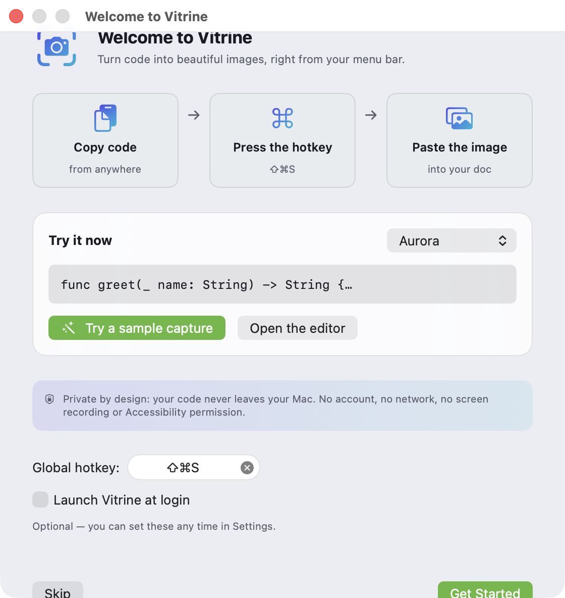
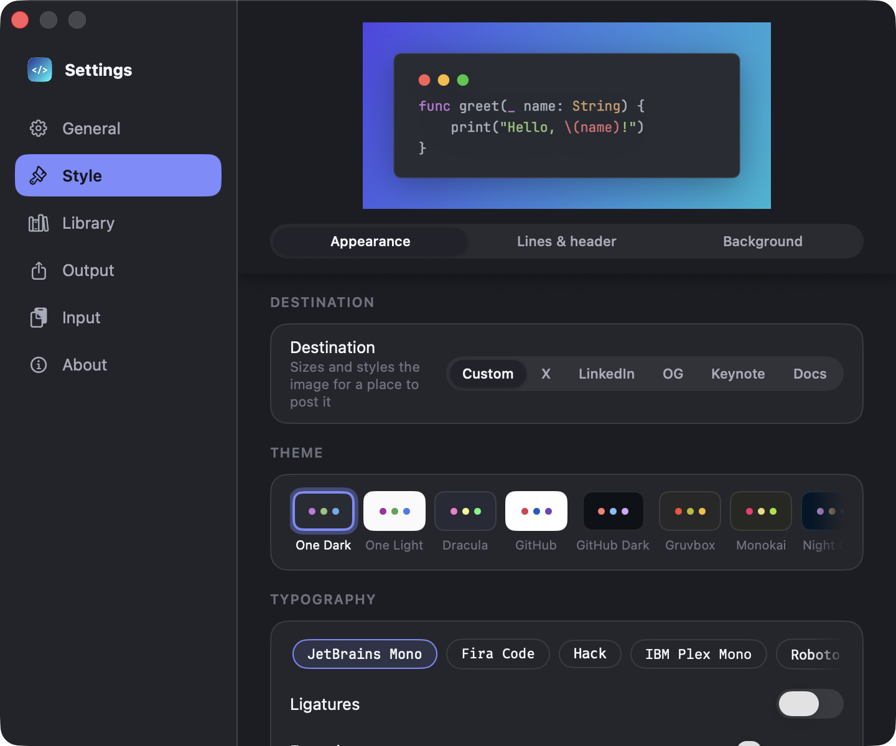

<div align="center">

# 📸 Vitrine

### Turn code into beautiful images — straight from your menu bar.

**Vitrine** is a native macOS menu-bar app that turns code (and, later, URLs and
HTML) into gorgeous, share-ready images — in the spirit of [ray.so](https://ray.so)
and [Carbon](https://carbon.now.sh), but **native, instant, and fully local**.

[](LICENSE)
[](#requirements)
[](https://swift.org)
[](#status)

</div>

---

## Why

`Carbon.now.sh` and `ray.so` are the go-to tools for turning code into images — but
they're **web apps**: open the browser, paste, configure, export. **None of them
live in your Mac's menu bar.** A developer who shares code on X, in docs, or in
slides does it many times a week, and every second of friction adds up.

Vitrine attacks that flow head-on:

- **0 seconds to open** — always present in the menu bar.
- **Code already loaded** — read straight from the clipboard.
- **Live preview** in the editor, or a no-UI quick mode that just works.
- **`Copy` → retina PNG** on your clipboard, ready to paste into Notion, Slack, X, Keynote.

Works **offline**, **100% local**, no account, no server. MIT-licensed.

> ray.so (built by Raycast) is open source and is exactly the bar we hold ourselves
> to for UX and design. The difference: Vitrine is **native and always one shortcut
> away in the menu bar** — not a web page, not a Raycast command.

## The flow you'll actually use

1. **Copy** what you want to share — a snippet of code today, and URLs in Product Phase 2.
2. **Trigger Vitrine** — global hotkey (`⇧⌘S`) or the menu-bar icon.
3. **Vitrine detects the content type** and picks the renderer:
   - **Code** → format + syntax highlight → a beautiful image, using the theme and
     style you preset in **Settings** (no questions asked).
   - **URL** → detected today and deliberately deferred; Product Phase 2 will snapshot
     the page locally with `WKWebView` (see [Product Phase 2](docs/RENDER-PHASES.md)).
4. **The code screenshot lands on your clipboard**, ready to paste anywhere — or save to a file.

Two modes, one engine:

- **Quick mode** — trigger → detect → render with your saved settings → clipboard. Zero or one click.
- **Editor mode** — opens a window with live preview and controls when you want to tweak before exporting.

## Install

Requires macOS **14.0+** (Sonoma or later). Every build is signed with a
Developer ID and notarized by Apple, and updates itself through Sparkle.

### Homebrew (recommended)

```bash
brew install --cask johnny4young/tap/vitrine
```

Homebrew downloads the DMG from the latest GitHub release, verifies its
SHA-256, and moves **Vitrine.app** into `/Applications`. Upgrades arrive
in-app ("Check for Updates…"), or via `brew upgrade --cask vitrine`. The cask
also puts the [`vitrine` CLI](#command-line-renderer) on your PATH (from v0.5.0).

### Direct download

Grab `Vitrine-x.y.z.dmg` from the
[latest release](https://github.com/johnny4young/vitrine/releases/latest),
open it, and drag **Vitrine** into **Applications**. Each DMG ships with a
`.sha256` sidecar if you want to verify the download:

```bash
shasum -a 256 -c Vitrine-x.y.z.dmg.sha256
```

### Build from source

```bash
git clone https://github.com/johnny4young/vitrine.git && cd vitrine && make
```

See [Getting started](#getting-started) for the full developer setup.

After launch, Vitrine lives in your **menu bar** (📸) — there is no Dock icon,
by design.

## Gallery

### The app

Captured from the real build (regenerate with the opt-in screenshot tour in
[`UITests/ScreenshotTourUITests.swift`](UITests/ScreenshotTourUITests.swift)).
The whole app follows one design system — a token layer
([`Vitrine/DesignSystem/`](Vitrine/DesignSystem)) shared by every surface, in
light and dark.

<div align="center">


| First-run quick-start | Settings | Menu-bar panel |
| --- | --- | --- |
|  |  |  |

</div>

### The exports

Every image below is **generated by Vitrine's own renderer** (`make gallery`), not a
hand-made mockup — so it's exactly what you'd export. The full launch gallery (themes,
languages, social presets, transparent backgrounds, and a high-contrast accessibility
sample) lives under [`Tests/Fixtures/Samples/`](Tests/Fixtures/Samples) and is reviewed
on every release.

<div align="center">

| Signature look (One Dark) | OpenGraph link card (1200×630) |
| --- | --- |
|  |  |

| Real syntax highlighting (Python) | High-contrast / accessibility |
| --- | --- |
|  |  |

</div>

> How the gallery is generated, what it covers, and the design-QA process live in
> [**docs/DESIGN-QA.md**](docs/DESIGN-QA.md).

## Features

- 🍫 Native **menu-bar app** (`MenuBarExtra`, `LSUIElement` — no Dock icon, no app switcher).
- ⌨️ Configurable **global hotkey** (`⇧⌘S`) via [KeyboardShortcuts](https://github.com/sindresorhus/KeyboardShortcuts).
- 🌈 **Syntax highlighting** for 160+ languages via [Highlightr](https://github.com/raspu/Highlightr) (Highlight.js).
- 🧹 **Tidy indentation on paste** — pasted code is re-indented by structure (braces, JSX tags, JSON), with a Settings toggle, undo with ⌘Z, and ⌥⌘F to format on demand.
- 🎨 **13 built-in themes** (One Dark, Dracula, Nord, Tokyo Night, Gruvbox, Monokai, Solarized, GitHub / GitHub Dark, Xcode Dark, Night Owl, and light variants) plus your own custom themes, gradients, window chrome, padding, fonts.
- 🖼️ **Retina PNG export** (`ImageRenderer` @2x/@3x) → clipboard or file, plus the macOS Share Sheet, with **PDF** as the scalable vector format. Exports are **sRGB by default** (Display P3 is an explicit advanced option) and transparent backgrounds keep real alpha.
- ⚙️ **Settings** — a six-pane sidebar window with a pinned live preview and chip pickers for themes, fonts, and backgrounds.
- ✨ A coherent **design system** — one token layer (colors, gradients, spacing, type) drives every surface in light and dark, and the editor stage glows with the ambient color of your background.
- 🕘 **Recents gallery** — a visual history of your captures, one click from the menu bar.
- 🚀 **First-run quick-start**, offline in-app **Help**, and a **What's New** window on upgrades.
- ⚡ **Shortcuts / App Intents** — render a code image or open the editor from Shortcuts and Spotlight.
- 🔁 **Sparkle auto-updates** on the direct-download (DMG) channel — "Check for Updates…" in the menu.
- 🌍 **Localized** in English and Spanish (String Catalog), with pseudolocale and RTL layout tests.
- 🖥️ **Command-line renderer** — `vitrine render input.swift --out image.png` for docs pipelines and automation, with output pixel-identical to the app (no network, screen recording, or Accessibility needed).
- 🔒 Sandboxed, no network by default — your code **never leaves your Mac**.

See the [**Status**](#status) section for what's shipped and what's deferred.

## Privacy

Vitrine is private by design, and that promise does not soften as the product grows:

- **Phase 1 (today): your code never leaves your Mac.** Rendering a code image is fully
  local and on-device. There is no account, no server, and no network access — the app
  ships sandboxed *without* the network entitlement. Rendering needs no Screen Recording
  or Accessibility permission.
- **Product Phase 2 (URL capture): the requested webpage loads locally.** When a copied
  URL is captured, Vitrine loads that webpage **locally in WebKit on your Mac** and turns
  it into an image on-device. There is **no remote screenshot service** — the URL is never
  sent off your machine to be rendered. URL capture is opt-in, gated behind the network
  entitlement (absent in Phase 1 builds), and shows a first-use disclosure that explains
  exactly this before any page loads. Only `http`/`https` URLs are accepted, and the web
  view uses a non-persistent data store by default (no cookies or website data persist
  across captures unless you opt in).
- **No analytics, no telemetry, ever.** Neither code rendering nor URL capture collects,
  tracks, or transmits any usage data. The bundled privacy manifest declares no tracking
  and no collected data, so the App Store privacy label is **Data Not Collected**.

The permission and privacy posture per phase is documented in
[**docs/PROJECT.md**](docs/PROJECT.md#privacy-and-permissions); the full
entitlement-by-entitlement audit table (per phase and per distribution channel) is in
[**docs/PERMISSIONS.md**](docs/PERMISSIONS.md).

## Tech stack

| Layer            | Choice                                                        |
| ---------------- | ------------------------------------------------------------- |
| Language          | **Swift 6**                                                  |
| UI                | **SwiftUI** + AppKit (`MenuBarExtra`, `NSTextView`, `NSPasteboard`) |
| Highlighting      | [Highlightr](https://github.com/raspu/Highlightr)            |
| Global hotkey     | [KeyboardShortcuts](https://github.com/sindresorhus/KeyboardShortcuts) |
| Auto-updates      | [Sparkle](https://sparkle-project.org) (direct-download channel) |
| View → image      | `ImageRenderer` (built-in)                                    |
| Project gen       | [XcodeGen](https://github.com/yonaskolb/XcodeGen) (`project.yml`) |

## Requirements

- macOS **14.0+** (Sonoma or later)
- **Xcode 16+**
- [XcodeGen](https://github.com/yonaskolb/XcodeGen) (`brew install xcodegen`) — the
  `.xcodeproj` is generated, not committed.

## Getting started

```bash
git clone https://github.com/johnny4young/vitrine.git
cd vitrine

# Generate Vitrine.xcodeproj from project.yml and open it
make            # == make bootstrap → xcodegen generate → open
```

Or step by step:

```bash
make project    # xcodegen generate  → Vitrine.xcodeproj
make open       # open Vitrine.xcodeproj in Xcode
make build      # headless xcodebuild (Debug)
make cli        # build the `vitrine` command-line renderer
make test       # run the Swift Testing suite
make build-ui-tests # compile UI tests without automation permission
make test-ui    # run UI smoke tests (first local run prompts for automation permission)
make gallery    # (re)generate the launch-gallery design-QA samples
make format     # swift-format in place
make lint       # swift-format lint (CI gate)
make icon       # regenerate the app icon set
```

Then hit **▶︎ Run** in Xcode. Vitrine appears in the menu bar (📸). There is no Dock
icon — that's intentional (`LSUIElement`).

> **Why is `Vitrine.xcodeproj` not in the repo?** It's generated from
> [`project.yml`](project.yml) so it can never drift from the spec and never causes
> merge conflicts. Run `make project` (or `xcodegen generate`) after cloning. See
> [CONTRIBUTING.md](CONTRIBUTING.md).

## Command-line renderer

Vitrine ships a `vitrine` CLI that renders code to an image without the GUI — handy
for docs pipelines and automation. It reuses the app's exact render path, so output is
pixel-identical, and it needs no network, screen recording, or Accessibility.

```bash
make cli   # builds `vitrine` into DerivedData, next to its Fonts/ and Highlightr bundle

vitrine render input.swift --out image.png
vitrine render snippet.py --out card.png --theme dracula --preset opengraph
vitrine render notes.go   --out clear.png --transparent --scale 3
vitrine render --help
```

Defaults match the app (One Dark, JetBrains Mono, aurora background); `--theme`,
`--language`, `--preset`, `--scale`, `--format` (`png`/`pdf`), `--profile`
(`srgb`/`p3`), and `--transparent` override individual choices.

The CLI ships **inside the app bundle**
(`Vitrine.app/Contents/MacOS/vitrine-cli`), so a [Homebrew install](#install)
symlinks it onto your PATH as `vitrine` automatically (from v0.5.0). With a
DMG install, link it yourself:

```bash
ln -s /Applications/Vitrine.app/Contents/MacOS/vitrine-cli /usr/local/bin/vitrine
```

When building from source, the dev binary lands in DerivedData next to its
`Fonts/` folder and `Highlightr_Highlightr.bundle` — keep them adjacent if you
relocate it. See [docs/ARCHITECTURE.md](docs/ARCHITECTURE.md) ("Command-line
renderer") for the hosting strategy and bundling details.

## Project layout

```
vitrine/
├── project.yml            # XcodeGen spec — source of truth for the Xcode project
├── Makefile               # bootstrap / project / build / test / gallery helpers
├── Vitrine/               # app source (see docs/ARCHITECTURE.md)
│   ├── App/               # @main, MenuBarExtra scene, AppDelegate, main menu, window controllers
│   ├── MenuBar/           # status-item menu + quick capture (no-UI mode)
│   ├── Onboarding/        # first-run quick-start
│   ├── Editor/            # code editor, ambient-light stage, inspector, language detection
│   ├── Canvas/            # the SwiftUI views that become the exported image
│   ├── Rendering/         # capture input → code render pipeline
│   ├── WebRendering/      # local URL/HTML snapshots (Product Phase 2)
│   ├── SocialCards/       # social-card composition
│   ├── Export/            # ImageRenderer → PNG/PDF → clipboard / file / share
│   ├── Recents/           # capture history + gallery window
│   ├── Help/              # offline Help + What's New release notes
│   ├── Feedback/          # capture HUD, notifications, diagnostics bundle
│   ├── Settings/          # six-pane Settings window, presets, custom themes
│   ├── DesignSystem/      # token layer (VitrineTokens) + shared chrome components
│   ├── AppIntents/        # Shortcuts / App Intents surface
│   ├── Updates/           # Sparkle auto-update integration (DMG channel)
│   ├── Services/          # macOS Services registration
│   ├── CLI/               # render core shared with the CLI target
│   ├── Models/, State/, Support/   # config, themes, persistence, logging
│   └── Resources/         # assets, Info.plist, entitlements, String Catalog
├── VitrineCLI/            # the `vitrine` command-line renderer target
├── Tests/                 # Swift Testing unit suite + golden/gallery fixtures
├── UITests/               # XCTest UI smokes + opt-in screenshot tour
└── docs/                  # full project documentation (mirrors the original spec)
```

## Documentation

Everything from the original product spec lives in [`docs/`](docs/) so you never need
to leave the repo:

- [**docs/PROJECT.md**](docs/PROJECT.md) — vision, positioning, naming, distribution, risks.
- [**docs/ARCHITECTURE.md**](docs/ARCHITECTURE.md) — menu-bar UX, user flow, modules, data model.
- [**docs/RENDER-PHASES.md**](docs/RENDER-PHASES.md) — "beyond code": OG cards, HTML/URL snapshots, and the optional web render service.
- [**docs/SCREEN-CAPTURE-DISCOVERY.md**](docs/SCREEN-CAPTURE-DISCOVERY.md) — why arbitrary screen/window capture is parked (Screen Recording trade-offs).
- [**docs/PERMISSIONS.md**](docs/PERMISSIONS.md) — the permission and entitlement matrix: every entitlement with its reason, user-facing behavior, and App Store impact, per phase and channel.
- [**docs/DESIGN-QA.md**](docs/DESIGN-QA.md) — the generated launch gallery and the design-QA process.
- [**docs/RELEASING.md**](docs/RELEASING.md) — signed/notarized DMG, Homebrew cask, release workflow.

> The detailed implementation spec (`docs/ROADMAP.md`, ticket-by-ticket acceptance
> criteria) is kept as a local working document and is intentionally git-ignored.

## Status

🟢 **v0.4.0 shipped, fully redesigned.** Menu-bar app (`LSUIElement`) with global
hotkey, the live-highlight editor on its ambient-light stage, WYSIWYG canvas, PNG/PDF
export to clipboard/file, the macOS share sheet, a Recents gallery, a six-pane sidebar
Settings window, first-run onboarding with offline Help and What's New, Shortcuts/App
Intents, launch-at-login, English + Spanish localization, Sparkle auto-updates on the
DMG channel, a privacy manifest, a reproducible app icon, and a tagged-release
pipeline (DMG + Homebrew cask). The entire UI is driven by one design-token system
([`Vitrine/DesignSystem/`](Vitrine/DesignSystem)), light and dark.
Covered by a Swift Testing unit suite plus XCTest UI smoke tests. CI runs lint, build,
the unit tests, and the full UI suite (GitHub's hosted macOS runners pre-authorize
XCTest UI automation; see docs/RELEASING.md).
The URL→screenshot path and OG cards are deliberately deferred (see RENDER-PHASES,
"Product Phase 2").

## Contributing

Themes and language tweaks are especially welcome. See [CONTRIBUTING.md](CONTRIBUTING.md)
and the conventions in [AGENTS.md](AGENTS.md). Security issues go privately through
[SECURITY.md](SECURITY.md).

## License

[MIT](LICENSE) © johnny4young
