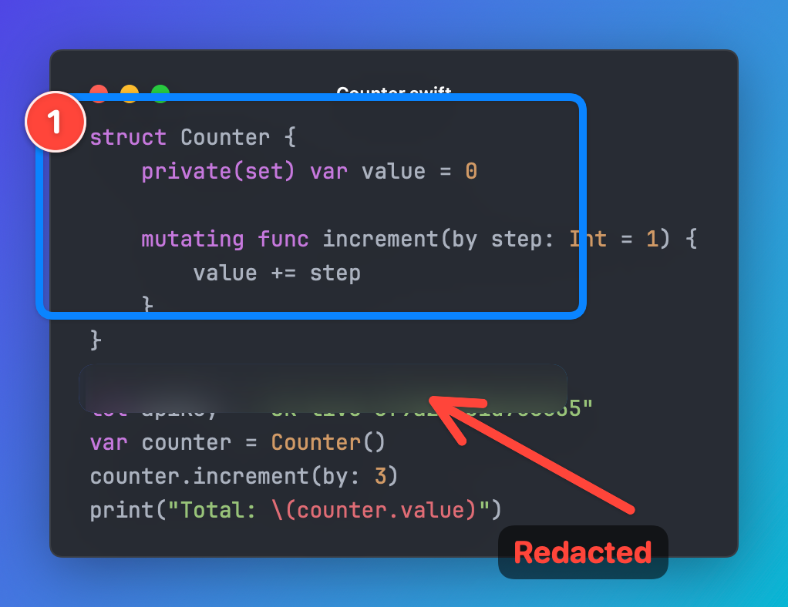
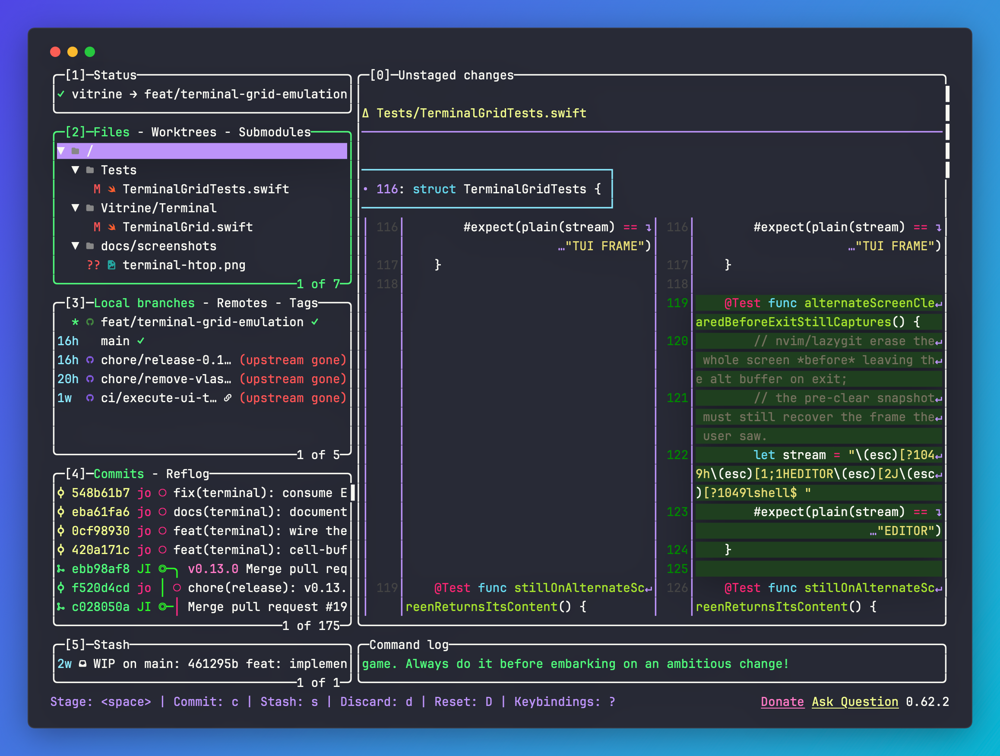

<div align="center">


# Vitrine

### Turn code into beautiful images — straight from your menu bar.

**Vitrine** is a native macOS menu-bar app that turns code (and URLs and HTML) into
gorgeous, share-ready images — in the spirit of [ray.so](https://ray.so) and
[Carbon](https://carbon.now.sh), but **native, instant, and fully local**.

[](https://vitrineframe.app)
[](LICENSE)
[](#requirements)
[](https://swift.org)
[](#status)

</div>

---

## Why

`Carbon.now.sh` and `ray.so` are the go-to tools for turning code into images — but
they're **web apps**: open the browser, paste, configure, export. **None of them
live in your Mac's menu bar.** A developer who shares code on X, in docs, or in
slides does it many times a week, and every second of friction adds up.

Vitrine attacks that flow head-on:

- **0 seconds to open** — always present in the menu bar.
- **Code already loaded** — read straight from the clipboard.
- **Live preview** in the editor, or a no-UI quick mode that just works.
- **`Copy` → retina PNG** on your clipboard, ready to paste into Notion, Slack, X, Keynote.

Works **offline**, **100% local**, no account, no telemetry. MIT-licensed — with an
optional [**PRO**](#vitrine-pro) tier for people who publish professionally.

> ray.so (built by Raycast) is open source and is exactly the bar we hold ourselves
> to for UX and design. The difference: Vitrine is **native and always one shortcut
> away in the menu bar** — not a web page, not a Raycast command.

## The flow you'll actually use

1. **Copy** what you want to share — a snippet of code, or a URL.
2. **Trigger Vitrine** — global hotkey (`⇧⌘S`) or the menu-bar icon.
3. **Vitrine detects the content type** and picks the renderer:
   - **Code** → format + syntax highlight → a beautiful image, using the theme and
     style you preset in **Settings** (no questions asked).
   - **URL** → snapshot the page **locally** with `WKWebView` on the direct-download
     build, with a first-use privacy disclosure (see [Render phases](docs/RENDER-PHASES.md)).
4. **The screenshot lands on your clipboard**, ready to paste anywhere — or save to a file.

Two modes, one engine:

- **Quick mode** — trigger → detect → render with your saved settings → clipboard. Zero or one click.
- **Editor mode** — opens a window with live preview and controls when you want to tweak before exporting.

## Install

Requires macOS **14.0+** (Sonoma or later). Every build is signed with a
Developer ID and notarized by Apple, and updates itself through Sparkle.

### Homebrew (recommended)

```bash
brew install --cask johnny4young/tap/vitrine
```

Homebrew downloads the DMG from the latest GitHub release, verifies its
SHA-256, and moves **Vitrine.app** into `/Applications`. Upgrades arrive
in-app ("Check for Updates…"), or via `brew upgrade --cask vitrine`. The cask
also puts the [`vitrine` CLI](#command-line-renderer) on your PATH (from v0.5.0).

### Direct download

Grab `Vitrine-x.y.z.dmg` from the
[latest release](https://github.com/johnny4young/vitrine/releases/latest) (or
from [vitrineframe.app](https://vitrineframe.app)), open it, and drag **Vitrine**
into **Applications**. Each DMG ships with a `.sha256` sidecar if you want to
verify the download:

```bash
shasum -a 256 -c Vitrine-x.y.z.dmg.sha256
```

### Build from source

```bash
git clone https://github.com/johnny4young/vitrine.git && cd vitrine && make
```

See [Getting started](#getting-started) for the full developer setup.

After launch, Vitrine lives in your **menu bar** (📸) — there is no Dock icon,
by design.

## Gallery

### The app

Captured from the real build (regenerate with the opt-in screenshot tour in
[`UITests/ScreenshotTourUITests.swift`](UITests/ScreenshotTourUITests.swift)).
The whole app follows one design system — a token layer
([`Vitrine/DesignSystem/`](Vitrine/DesignSystem)) shared by every surface, in
light and dark.

<div align="center">


| First-run quick-start | Settings | Menu-bar panel |
| --- | --- | --- |
|  |  |  |

</div>

### The exports

Every image below is **generated by Vitrine's own renderer** (`make gallery`), not a
hand-made mockup — so it's exactly what you'd export. The full launch gallery (themes,
languages, social presets, transparent backgrounds, and a high-contrast accessibility
sample) lives under [`Tests/Fixtures/Samples/`](Tests/Fixtures/Samples) and is reviewed
on every release.

<div align="center">

| Signature look (One Dark) | OpenGraph link card (1200×630) |
| --- | --- |
|  |  |

| Real syntax highlighting (Python) | High-contrast / accessibility |
| --- | --- |
|  |  |

| Annotated markup (counter, box, blur, arrow) | GitHub-style diff coloring |
| --- | --- |
|  |  |

**Full-screen TUIs** — Vitrine reconstructs the final screen (cursor moves, colors, and all), not just scrolling output. Real captures of `htop`, `lazygit`, and Neovim:

| `htop` · One Dark | `lazygit` · Dracula | `nvim` · Nord |
| --- | --- | --- |
|  |  |  |

</div>

> How the gallery is generated, what it covers, and the design-QA process live in
> [**docs/DESIGN-QA.md**](docs/DESIGN-QA.md).

## Features

Vitrine does one thing — turn code into an image worth sharing — and does it without
ever leaving your Mac.

### Capture

Lives in the menu bar (`LSUIElement`, no Dock icon) and opens from anywhere with a
global hotkey (`⇧⌘S`). It reads the clipboard, detects whether you copied **code,
terminal output, a URL, or HTML**, and picks the renderer for you — one-step Quick mode
using your saved style, or the editor when you want to fine-tune.

### Beautify any image

Not just code — drop, paste, or quick-capture **any screenshot** and render it on the
same gradients, padding, and shadow. Frame it as a **macOS window**, a **browser**, or a
**MacBook / iPhone** mockup, with chrome that auto-tints to the image's own colors so it
blends in. *(Browser and device frames are [PRO](#vitrine-pro).)*

### Style

Thirteen built-in themes (plus your own), 160+ languages of real syntax highlighting,
developer fonts, and solid / gradient / image backgrounds. **Focus mode** dims
everything but the lines that matter; **diff coloring** bands `+`/`−` lines
GitHub-style; window chrome, padding, corner radius, and shadow are all yours to tune.

### Annotate

A CleanShot-style palette in the title bar — arrows, lines, rectangles, text callouts,
a highlighter, blur/redaction boxes, and numbered counters. Draw them on the live
preview, move and resize with handles, undo with ⌘Z; they are baked into the export.
**Redact secrets** goes one better: one click scans the capture for API keys, tokens,
and passwords and blurs those lines for you — image *and* copyable text.

### Export & share

Retina **PNG** and **PDF** to the clipboard, a file, or the Share Sheet — sRGB by
default (Display P3 on demand), with real alpha for transparent backgrounds.
Destination presets cover **OpenGraph** (1200×630), an **Instagram Story**, and a
**GitHub banner**. [PRO](#vitrine-pro) adds **multi-size one-pass export** and the bundled
**`vitrine` CLI** that renders the same pixels from your terminal.

### Crafted & private

One design-token system drives every surface in light and dark. Localized in English
and Spanish, updated over Sparkle on the direct-download build, and reachable from
Shortcuts and App Intents.

> [!NOTE]
> **Private by design.** Rendering is fully local and sandboxed — no account, no
> network by default, no telemetry. Your code never leaves your Mac.

**At a glance**

| Area | What you get |
| --- | --- |
| **Capture** | Menu-bar app, global hotkey, clipboard auto-detect (code · URL · HTML), Quick and editor modes |
| **Beautify** | Drop/paste any image → frame it (macOS window · browser · MacBook · iPhone) with auto-matched chrome |
| **Style** | 13 themes + custom, 160+ languages, fonts, gradient & image backgrounds, focus mode, diff coloring |
| **Annotate** | Arrows, lines, boxes, text, highlighter, blur, numbered counters — on the live preview, with undo/redo |
| **Redact** | One-click secret scan — blurs API keys / tokens / passwords in the image *and* the copyable text |
| **Export** | Retina PNG/PDF, clipboard · file · Share Sheet, OpenGraph · Story · GitHub-banner presets |
| **Platform** | One design system (light & dark), English + Spanish, Sparkle updates, recents |
| **PRO** | Brand Kit watermark · multi-size one-pass export · automation (`vitrine` CLI, Shortcuts/App Intents, folder batch) — optional one-time license |

<details>
<summary>Everything, in detail</summary>

- 🍫 Native **menu-bar app** (`MenuBarExtra`, `LSUIElement` — no Dock icon, no app switcher).
- ⌨️ Configurable **global hotkey** (`⇧⌘S`) via [KeyboardShortcuts](https://github.com/sindresorhus/KeyboardShortcuts).
- 🌈 **Syntax highlighting** for 160+ languages via [Highlightr](https://github.com/raspu/Highlightr) (Highlight.js).
- 🖥️ **Terminal output → image** — paste or drop colored terminal output (`git`, test runners, build logs) and Vitrine renders the ANSI/SGR styling (16 / 256 / truecolor, bold · italic · underline · strikethrough · inverse, plus OSC 8 hyperlinks); the palette follows your theme. The `vgrab` shell helper *(PRO)* captures a command's output with its color intact — including **full-screen TUIs** (`htop`, `vim`, `lazygit`), whose final screen Vitrine reconstructs with a cell-buffer emulator — wide CJK and emoji included — and a copyable-text sidecar can ship the output as text alongside the image. → [`docs/TERMINAL.md`](docs/TERMINAL.md).
- 🖼️ **Beautify any image** — drop, paste, or quick-capture any screenshot (not just code) and render it on the same backgrounds, padding, and shadow, optionally wrapped in a macOS-window, browser, or MacBook / iPhone device frame. The frame chrome auto-tints to the image's top-edge color so it blends in (Light/Dark are manual overrides). Browser and device frames are PRO.
- 🧹 **Tidy indentation on paste** — pasted code is re-indented by structure (braces, JSX tags, JSON), with a Settings toggle, undo with ⌘Z, and ⌥⌘F to format on demand.
- 🎨 **13 built-in themes** (One Dark, Dracula, Nord, Tokyo Night, Gruvbox, Monokai, Solarized, GitHub / GitHub Dark, Xcode Dark, Night Owl, and light variants) plus your own custom themes, gradients, window chrome, padding, fonts.
- ✏️ **Annotate the snapshot** — a CleanShot-style tool palette in the title bar: arrows, lines, rectangles, text callouts, a highlighter, blur/redaction boxes, and numbered counters. Draw them on the live preview, move/resize with handles, restyle color and thickness, and undo/redo with ⌘Z.
- 🔒 **Redact secrets in one click** — scan the capture for likely API keys, tokens, passwords, and private keys (AWS, GitHub, Slack, Google, Stripe, OpenAI, JWTs, `name = value` assignments) and blur the matching lines before you share. The copyable text rider (clipboard / `--text-sidecar`) is sanitized too, so the secret can't leak through the text the image hides; terminal captures are scanned on the resolved screen.
- 🎯 **Focus & diff** — dim the lines outside your highlight, and color `+`/`−` diff lines GitHub-style (automatic for the Diff language). Plus an optional window title and tunable corner radius and shadow.
- 🖼️ **Retina PNG export** (`ImageRenderer` @2x/@3x) → clipboard or file, plus the macOS Share Sheet, with **PDF** as the scalable vector format. Exports are **sRGB by default** (Display P3 is an explicit advanced option) and transparent backgrounds keep real alpha.
- 🪧 **Social cards** — compose a 1200×630 card from your code (template, theme, background) to copy, save, or share, with **Instagram Story** and **GitHub banner** export presets.
- 🌐 **Web snapshots** — render pasted **HTML** to an image, or capture a **webpage** (direct-download build) — entirely locally in WebKit, with a first-use privacy disclosure. Pick **several viewports at once** (social · desktop · Full HD · mobile · custom) and Vitrine captures each in one pass, then composes them into a shareable **responsive board** — desktop, tablet, and phone side by side for responsive QA.
- ⚙️ **Settings** — a six-pane sidebar window with a pinned live preview and chip pickers for themes, fonts, and backgrounds.
- ✨ A coherent **design system** — one token layer (colors, gradients, spacing, type) drives every surface in light and dark, and the editor stage glows with the ambient color of your background.
- 🕘 **Recents gallery** — a visual history of your captures, one click from the menu bar.
- 🚀 **First-run quick-start**, offline in-app **Help**, and a **What's New** window on upgrades.
- ⚡ **Shortcuts / App Intents** *(PRO)* — render a code image or open the editor from Shortcuts and Spotlight.
- 🔁 **Sparkle auto-updates** on the direct-download (DMG) channel — "Check for Updates…" in the menu.
- 🌍 **Localized** in English and Spanish (String Catalog), with pseudolocale and RTL layout tests.
- 🖥️ **Command-line renderer** *(PRO)* — `vitrine render input.swift --out image.png` for docs pipelines and automation, with output pixel-identical to the app (no network, screen recording, or Accessibility needed).
- 💎 **PRO power features** — [Brand Kit](#vitrine-pro) watermark, multi-size one-pass export, and the automation surfaces above; the free tier loses nothing.
- 🔒 Sandboxed, no network by default — your code **never leaves your Mac**.

</details>

## Vitrine PRO

Vitrine is **open-core**: the app is and stays free and fully open source (MIT), and the
free tier loses nothing — no watermark, no resolution cap, no launch-time nags. **PRO** is
an optional **one-time** license that adds a few power features for people who publish
professionally:

- **Brand Kit** — your logo, handle, and accent color applied as a tasteful watermark to
  every export, in one click.
- **Multi-size export** — one capture rendered to every platform size (X, LinkedIn,
  OpenGraph, …) into a folder in a single pass.
- **Automation** — the `vitrine` command-line renderer, Shortcuts / App Intents, and folder
  batch rendering.

It is **honor/convenience, not anti-fork DRM**. On the Mac App Store, PRO is a StoreKit
in-app purchase; on the direct-download build, a license key activates **once** online and
the app then verifies an **offline, signed token** on every launch (the bundled CLI
re-verifies the same token), so PRO works without the network after activation. Nothing
about your code or usage is ever sent. Details: [`docs/PRO.md`](docs/PRO.md).

## Privacy

Vitrine is private by design, and that promise does not soften as the product grows:

- **Code rendering: your code never leaves your Mac.** Rendering a code image is fully
  local and on-device — no account, and no network at all on the App Store build (it ships
  sandboxed *without* the network entitlement). Rendering needs no Screen Recording or
  Accessibility permission.
- **URL capture: the requested webpage loads locally.** When a copied URL is captured,
  Vitrine loads that webpage **locally in WebKit on your Mac** and turns it into an image
  on-device. There is **no remote screenshot service** — the URL is never sent off your
  machine to be rendered. URL capture is opt-in, gated behind the network entitlement
  (present only on the direct-download build), and shows a first-use disclosure before any
  page loads. Only `http`/`https` URLs are accepted, private and loopback hosts are refused,
  and the web view uses a non-persistent data store by default (no cookies or website data
  persist across captures unless you opt in).
- **PRO activation contacts only the license provider, once.** On the direct-download build,
  activating a PRO license makes a single online check to the license provider (Lemon
  Squeezy) to validate your key; afterward PRO is verified from an offline signed token and
  never touches the network again. Nothing about your code or usage is sent. (On the Mac App
  Store, PRO is an ordinary StoreKit purchase.)
- **No analytics, no telemetry, ever.** Code rendering, URL capture, and PRO activation
  collect, track, and transmit **no** usage data. The bundled privacy manifest declares no
  tracking and no collected data, so the App Store privacy label is **Data Not Collected**.

The permission and privacy posture per phase is documented in
[**docs/PROJECT.md**](docs/PROJECT.md#privacy-and-permissions); the full
entitlement-by-entitlement audit table (per phase and per distribution channel) is in
[**docs/PERMISSIONS.md**](docs/PERMISSIONS.md).

## Tech stack

| Layer            | Choice                                                        |
| ---------------- | ------------------------------------------------------------- |
| Language          | **Swift 6**                                                  |
| UI                | **SwiftUI** + AppKit (`MenuBarExtra`, `NSTextView`, `NSPasteboard`) |
| Highlighting      | [Highlightr](https://github.com/raspu/Highlightr)            |
| Global hotkey     | [KeyboardShortcuts](https://github.com/sindresorhus/KeyboardShortcuts) |
| Auto-updates      | [Sparkle](https://sparkle-project.org) (direct-download channel) |
| View → image      | `ImageRenderer` (built-in)                                    |
| Project gen       | [XcodeGen](https://github.com/yonaskolb/XcodeGen) (`project.yml`) |

## Requirements

- macOS **14.0+** (Sonoma or later)
- **Xcode 16+**
- [XcodeGen](https://github.com/yonaskolb/XcodeGen) (`brew install xcodegen`) — the
  `.xcodeproj` is generated, not committed.

## Getting started

```bash
git clone https://github.com/johnny4young/vitrine.git
cd vitrine

# Generate Vitrine.xcodeproj from project.yml and open it
make            # == make bootstrap → xcodegen generate → open
```

Or step by step:

```bash
make project    # xcodegen generate  → Vitrine.xcodeproj
make open       # open Vitrine.xcodeproj in Xcode
make build      # headless xcodebuild (Debug)
make cli        # build the `vitrine` command-line renderer
make test       # run the Swift Testing suite
make build-ui-tests # compile UI tests without automation permission
make test-ui    # run UI smoke tests (first local run prompts for automation permission)
make gallery    # (re)generate the launch-gallery design-QA samples
make format     # swift-format in place
make lint       # swift-format lint (CI gate)
make icon       # regenerate the app icon set
```

Then hit **▶︎ Run** in Xcode. Vitrine appears in the menu bar (📸). There is no Dock
icon — that's intentional (`LSUIElement`).

> **Why is `Vitrine.xcodeproj` not in the repo?** It's generated from
> [`project.yml`](project.yml) so it can never drift from the spec and never causes
> merge conflicts. Run `make project` (or `xcodegen generate`) after cloning. See
> [CONTRIBUTING.md](CONTRIBUTING.md).

## Command-line renderer

Vitrine ships a `vitrine` CLI that renders code to an image without the GUI — handy
for docs pipelines and automation. It reuses the app's exact render path, so output is
pixel-identical, and it needs no network, screen recording, or Accessibility.

```bash
make cli   # builds `vitrine` into DerivedData, next to its Fonts/ and Highlightr bundle

vitrine render input.swift --out image.png
vitrine render snippet.py --out card.png --theme dracula --preset opengraph
vitrine render notes.go   --out clear.png --transparent --scale 3
vitrine render long-line.swift --out wrapped.png --wrap-columns 80
vitrine render snippet.swift --out compact.png --font "Fira Code" --font-ligatures \
  --font-size 12 --padding 24 --corner-radius 10 --shadow-radius 12
vitrine render diff.patch --out review.png --language diff --highlight-lines 3,7-9 \
  --focus-lines --diff-bands
vitrine render changelog.md --out release.png --title "Release notes" --language-badge
vitrine render snippet.swift --out card.png --sidecars all
cat Component.tsx | vitrine render --stdin --stdin-name Component.tsx --out card.png
vitrine render input.swift --out image.png --quiet --no-overwrite
vitrine render input.swift --out image.png --json --no-overwrite
vitrine render input.swift --out image.pdf
vitrine list themes
vitrine list languages --json
vitrine list all --json
vitrine list fonts
vitrine list formats
vitrine list profiles --json
vitrine --version
vitrine version --json
vitrine batch Sources --out docs/cards --recursive --dry-run --include-ext swift,md \
  --fail-on-empty
vitrine batch Sources --out docs/cards --recursive --include-ext swift,md --exclude-ext tmp \
  --sidecars all --fail-on-empty --fail-on-skipped --skipped-report docs/cards/skipped.json \
  --manifest docs/cards/manifest.json
vitrine render --help
```

Defaults match the app (One Dark, JetBrains Mono, aurora background); `--quiet`
suppresses the success summary for scripts while leaving errors visible, and `--json`
prints `render`/`batch` success summaries as structured JSON (mutually exclusive with
`--quiet`). `--theme`,
`--language`, `--preset`, `--scale`, `--format` (`png`/`pdf`/`heic`), `--profile`
(`srgb`/`p3`), `--font <family>`, `--font-ligatures`, `--no-font-ligatures`,
`--transparent`, style controls (`--font-size`, `--padding`, `--wrap-columns`,
`--corner-radius`, `--shadow-radius`, `--line-numbers`, `--no-chrome`, `--shadow`,
`--no-shadow`, `--highlight-lines <spec>`, `--focus-lines`, `--no-focus-lines`,
`--diff-bands`, `--no-diff-bands`), and the header controls (`--window-title`,
`--filename`, `--title`, `--caption`, `--language-badge`) override
individual choices. For single-file `render`, a known
`--out` extension (`.png`, `.pdf`, or `.heic`) selects the matching format when
`--format` is omitted; if both are present, they must agree so scripts never write
mislabeled artifacts. With `--stdin`, `--stdin-name <name>` supplies a filename hint
for extension-based language inference and default metadata without reading that file.
`--no-overwrite` (alias `--no-clobber`) refuses to replace
existing image or sidecar outputs; in `batch`, existing targets are reported as
skipped so the remaining new cards can still be produced. `--text-sidecar`,
`--markdown-sidecar`, `--html-sidecar`, or `--sidecars all` write copyable source
beside the image for accessible docs, README, or web embeds. `vitrine batch --recursive`
walks nested folders and mirrors their relative paths under the output folder; `--dry-run`
scans and decodes the matching
inputs without writing images or sidecars. `--include-ext <list>` and
`--exclude-ext <list>` let docs pipelines pre-filter known source extensions before
loading files. Add `--fail-on-empty` when CI should fail if those filters leave no
renderable inputs, `--fail-on-skipped` when CI should fail if any unreadable or non-text
file was skipped, and `--skipped-report <json>` to write a parseable skipped-files
artifact. `--manifest <json>` writes a positive manifest of rendered outputs (or
planned outputs during `--dry-run`) with relative paths and dimensions when available.
When a batch contains same-stem files such as `Widget.swift` and `Widget.ts`, only
that colliding group preserves the input extension (`Widget.swift.png`,
`Widget.ts.png`) so one artifact never overwrites the other.
`vitrine list <all|themes|languages|presets|fonts|formats|profiles> [--json]` prints
the local catalog ids accepted by those flags so scripts can discover them without scraping docs;
`vitrine list all --json` returns one object containing every catalog.
`vitrine --version` / `vitrine version --json` reports the installed CLI version before
AppKit initialization or the PRO render gate, which makes CI install checks cheap.

The CLI ships **inside the app bundle**
(`Vitrine.app/Contents/MacOS/vitrine-cli`), so a [Homebrew install](#install)
symlinks it onto your PATH as `vitrine` automatically (from v0.5.0). With a
DMG install, use **Settings ▸ General ▸ Command-line tool ▸ Install…** — or
link it yourself:

```bash
sudo ln -sf '/Applications/Vitrine.app/Contents/MacOS/vitrine-cli' /usr/local/bin/vitrine
```

When building from source (`make cli`), the dev binary lands in DerivedData as
`vitrine-cli` next to its `Fonts/` folder and `Highlightr_Highlightr.bundle` —
keep them adjacent if you relocate it. See
[docs/ARCHITECTURE.md](docs/ARCHITECTURE.md) ("Command-line renderer") for the
hosting strategy and bundling details.

## Project layout

```
vitrine/
├── project.yml            # XcodeGen spec — source of truth for the Xcode project
├── Makefile               # bootstrap / project / build / test / gallery helpers
├── Vitrine/               # app source (see docs/ARCHITECTURE.md)
│   ├── App/               # @main, MenuBarExtra scene, AppDelegate, main menu, window controllers
│   ├── MenuBar/           # status-item menu + quick capture (no-UI mode)
│   ├── Onboarding/        # first-run quick-start
│   ├── Editor/            # code editor, ambient-light stage, inspector, language detection
│   ├── Canvas/            # the SwiftUI views that become the exported image
│   ├── Rendering/         # capture input → code render pipeline
│   ├── WebRendering/      # local URL/HTML snapshots (WebKit, on-device)
│   ├── SocialCards/       # social-card composition
│   ├── Export/            # ImageRenderer → PNG/PDF → clipboard / file / share
│   ├── Recents/           # capture history + gallery window
│   ├── Help/              # offline Help + What's New release notes
│   ├── Feedback/          # capture HUD, notifications, diagnostics bundle
│   ├── Settings/          # six-pane Settings window, presets, custom themes
│   ├── Pro/               # open-core PRO gate: entitlements, StoreKit + license providers, Brand Kit, paywall
│   ├── DesignSystem/      # token layer (VitrineTokens) + shared chrome components
│   ├── AppIntents/        # Shortcuts / App Intents surface
│   ├── Updates/           # Sparkle auto-update integration (DMG channel)
│   ├── Services/          # macOS Services registration
│   ├── CLI/               # render core shared with the CLI target
│   ├── Models/, State/, Support/   # config, themes, persistence, logging
│   └── Resources/         # assets, Info.plist, entitlements, String Catalog
├── VitrineCLI/            # the `vitrine` command-line renderer target
├── Tests/                 # Swift Testing unit suite + golden/gallery fixtures
├── UITests/               # XCTest UI smokes + opt-in screenshot tour
└── docs/                  # full project documentation (mirrors the original spec)
```

## Documentation

Everything from the original product spec lives in [`docs/`](docs/) so you never need
to leave the repo:

- [**CHANGELOG.md**](CHANGELOG.md) — the complete, versioned change history ([Keep a Changelog](https://keepachangelog.com)).
- [**docs/PROJECT.md**](docs/PROJECT.md) — vision, positioning, naming, distribution, risks.
- [**docs/ARCHITECTURE.md**](docs/ARCHITECTURE.md) — menu-bar UX, user flow, modules, data model.
- [**docs/PRO.md**](docs/PRO.md) — the PRO subsystem: the open-core gate, per-build providers, Brand Kit, multi-size export, and automation.
- [**docs/ACTIVATION.md**](docs/ACTIVATION.md) — direct-download PRO activation runbook: keypair generation, build-time key injection, and the Lemon Squeezy product.
- [**docs/RENDER-PHASES.md**](docs/RENDER-PHASES.md) — "beyond code": OG cards, HTML/URL snapshots, and the optional web render service.
- [**docs/SCREEN-CAPTURE-DISCOVERY.md**](docs/SCREEN-CAPTURE-DISCOVERY.md) — why arbitrary screen/window capture is parked (Screen Recording trade-offs).
- [**docs/PERMISSIONS.md**](docs/PERMISSIONS.md) — the permission and entitlement matrix: every entitlement with its reason, user-facing behavior, and App Store impact, per phase and channel.
- [**docs/DESIGN-QA.md**](docs/DESIGN-QA.md) — the generated launch gallery and the design-QA process.
- [**docs/RELEASING.md**](docs/RELEASING.md) — signed/notarized DMG, Homebrew cask, release workflow.

> The detailed implementation spec (`docs/ROADMAP.md`, ticket-by-ticket acceptance
> criteria) is kept as a local working document and is intentionally git-ignored.

## Status

🟢 **v0.20.0 — shipped and stable.** Everything under [Features](#features) is built and
driven by one design-token system ([`Vitrine/DesignSystem/`](Vitrine/DesignSystem)) in
light and dark. It is covered by a Swift Testing unit suite plus XCTest UI smokes; CI
runs lint, build, the unit tests, and the full UI suite on GitHub's hosted macOS runners
(which pre-authorize XCTest UI automation — see [docs/RELEASING.md](docs/RELEASING.md)).
The complete, versioned history lives in [CHANGELOG.md](CHANGELOG.md), and every release
also ships an in-app **What's New**.

What's deliberately parked — arbitrary screen/window capture (Screen Recording
trade-offs) and a hosted web-render service — is written up in
[docs/SCREEN-CAPTURE-DISCOVERY.md](docs/SCREEN-CAPTURE-DISCOVERY.md) and
[docs/RENDER-PHASES.md](docs/RENDER-PHASES.md).

## Contributing

Themes and language tweaks are especially welcome. See [CONTRIBUTING.md](CONTRIBUTING.md)
and the conventions in [AGENTS.md](AGENTS.md). Security issues go privately through
[SECURITY.md](SECURITY.md).

## License

[MIT](LICENSE) © johnny4young
