<div align="center">

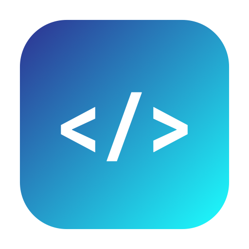

# Vitrine

### Turn code into beautiful images — straight from your menu bar.

**Vitrine** is a native macOS menu-bar app that turns code (and URLs and HTML) into
gorgeous, share-ready images — in the spirit of [ray.so](https://ray.so) and
[Carbon](https://carbon.now.sh), but **native, instant, and local for code rendering**.
Optional URL snapshots load the requested page in WebKit on your Mac.

[](https://vitrineframe.app)
[](LICENSE)
[](#requirements)
[](https://swift.org)
[](#status)

</div>

---

## Why

`Carbon.now.sh` and `ray.so` are the go-to tools for turning code into images — but
they're **web apps**: open the browser, paste, configure, export. **None of them
live in your Mac's menu bar.** A developer who shares code on X, in docs, or in
slides does it many times a week, and every second of friction adds up.

Vitrine attacks that flow head-on:

- **0 seconds to open** — always present in the menu bar.
- **Code already loaded** — read straight from the clipboard.
- **Live preview** in the editor, or a no-UI quick mode that just works.
- **`Copy` → retina PNG** on your clipboard, ready to paste into Notion, Slack, X, Keynote.

Code, terminal, image, and pasted-HTML rendering all work offline with no account or
telemetry. The direct-download build uses the network for Sparkle updates, license
activation, and URL content you explicitly ask it to load. MIT-licensed — with an
optional [**PRO**](#vitrine-pro) tier for people who publish professionally.

> ray.so (built by Raycast) is open source and is exactly the bar we hold ourselves
> to for UX and design. The difference: Vitrine is **native and always one shortcut
> away in the menu bar** — not a web page, not a Raycast command.

## The flow you'll actually use

1. **Copy** what you want to share — a snippet of code, terminal output, or a URL.
2. **Trigger Vitrine** — global hotkey (`⇧⌘S`) or the menu-bar icon.
3. **Vitrine detects the content type** and picks the renderer:
   - **Code** → format + syntax highlight → a beautiful image, using the theme and
     style you preset in **Settings** (no questions asked).
   - **URL** → open the Web Snapshot editor, which loads the requested page **locally**
     with `WKWebView` on the direct-download build, after a first-use privacy disclosure
     (see [Rendering architecture](docs/RENDERING.md)).
   - **HTML** → paste it into the Web Snapshot editor; pasted HTML renders offline and
     remote subresources are blocked.
4. **Code captures** can land on your clipboard as a screenshot, ready to paste anywhere.
   URL snapshots are exported from the Web Snapshot editor.

Two modes, one engine:

- **Quick mode** — trigger → detect → render code with your saved settings → clipboard.
  URL input opens Web Snapshot instead of silently pretending it is a code capture.
- **Editor mode** — opens a window with live preview and controls when you want to tweak before exporting.

## Install

Requires macOS **14.0+** (Sonoma or later). Official DMG releases are signed with a
Developer ID, notarized by Apple, and updated through Sparkle. App Store releases are
updated by the App Store; source builds use your local signing configuration.

### Homebrew (recommended)

```bash
brew install --cask johnny4young/tap/vitrine
```

Homebrew downloads the DMG from the latest GitHub release, verifies its
SHA-256, and moves **Vitrine.app** into `/Applications`. Upgrades arrive
in-app ("Check for Updates…"), or via `brew upgrade --cask vitrine`. The cask
also puts the [`vitrine` CLI](#command-line-renderer) on your PATH (from v0.5.0).

### Direct download

Grab `Vitrine-x.y.z.dmg` from the
[latest release](https://github.com/johnny4young/vitrine/releases/latest) (or
from [vitrineframe.app](https://vitrineframe.app)), open it, and drag **Vitrine**
into **Applications**. Each DMG ships with a `.sha256` sidecar if you want to
verify the download:

```bash
shasum -a 256 -c Vitrine-x.y.z.dmg.sha256
```

The DMG embeds the direct-download `vitrine` CLI but does **not** add it to your
PATH automatically. After launching the app, use **Settings ▸ General ▸ Command-line
tool ▸ Install…**, or follow the manual link in [Command-line renderer](#command-line-renderer).

### Build from source

```bash
git clone https://github.com/johnny4young/vitrine.git && cd vitrine && make
```

See [Getting started](#getting-started) for the full developer setup.

After launch, Vitrine lives in your **menu bar** (📸) — there is no Dock icon,
by design.

## Gallery

### The app

Captured from the real build (regenerate with the opt-in screenshot tour in
[`UITests/ScreenshotTourUITests.swift`](UITests/ScreenshotTourUITests.swift)).
The whole app follows one design system — a token layer
([`Vitrine/DesignSystem/`](Vitrine/DesignSystem)) shared by every surface, in
light and dark.

<div align="center">

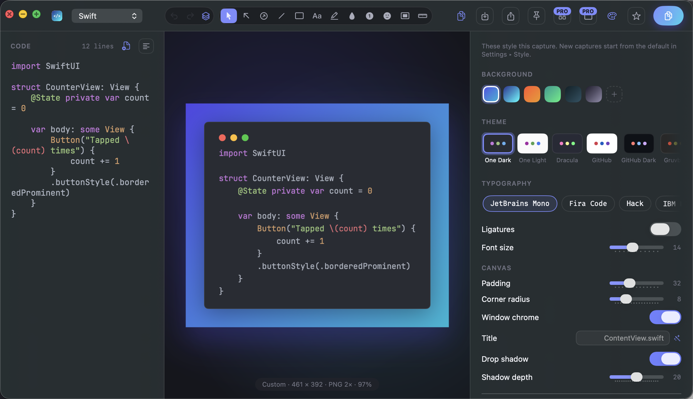

| First-run quick-start | Settings | Menu-bar panel |
| --- | --- | --- |
| 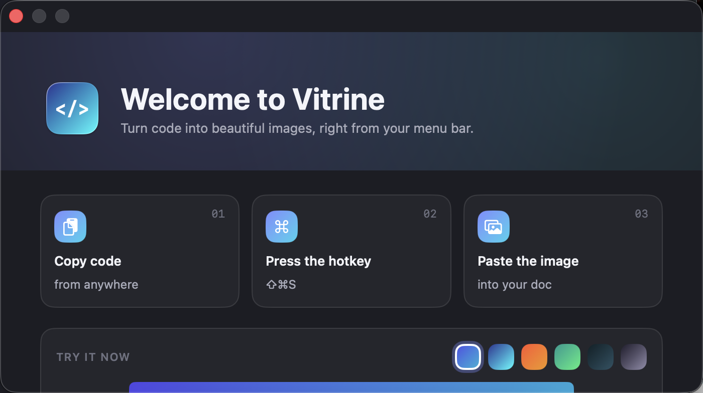 | 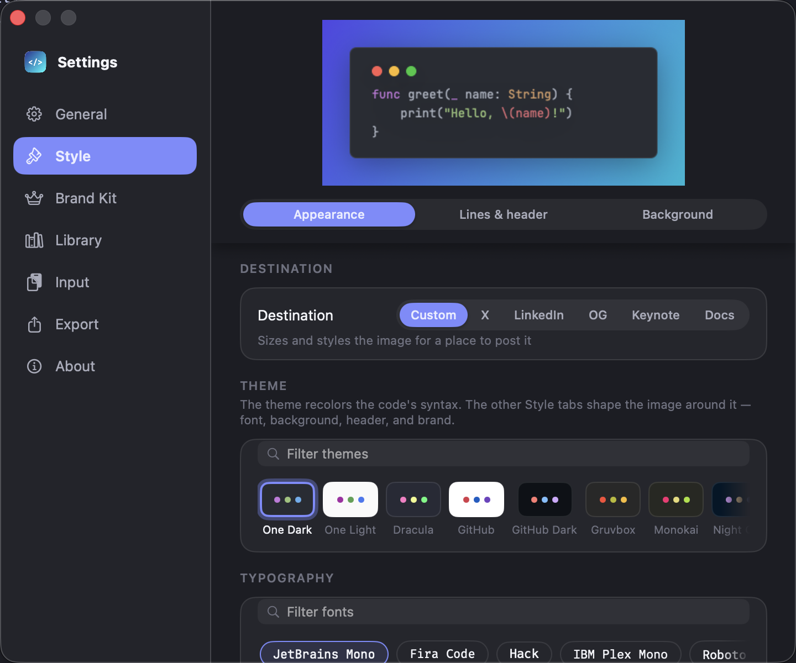 | 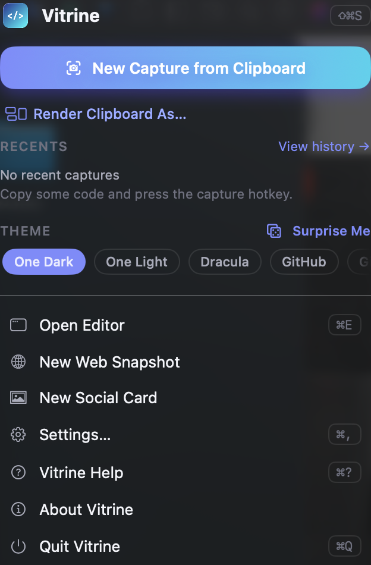 |

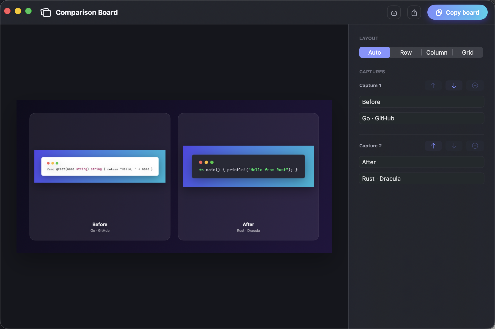

</div>

### The exports

Every image below is **generated by Vitrine's own renderer** (`make gallery`), not a
hand-made mockup — so it's exactly what you'd export. The full launch gallery (themes,
languages, social presets, transparent backgrounds, and a high-contrast accessibility
sample) lives under [`Tests/Fixtures/Samples/`](Tests/Fixtures/Samples) and is reviewed
on every release.

<div align="center">

| Signature look (One Dark) | OpenGraph link card (1200×630) |
| --- | --- |
| 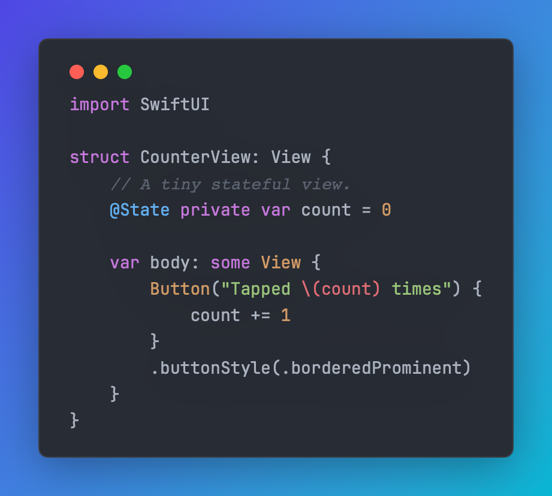 | 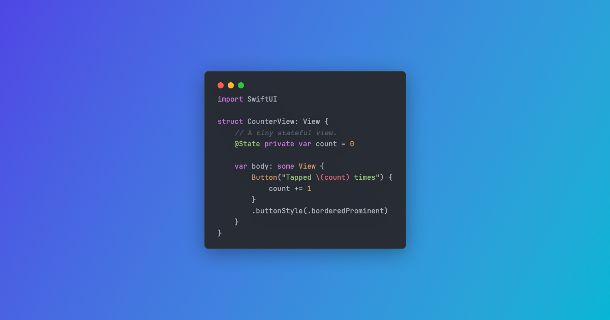 |

| Real syntax highlighting (Python) | High-contrast / accessibility |
| --- | --- |
| 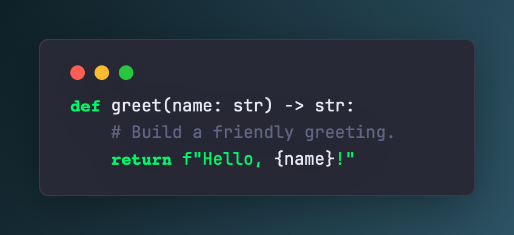 | 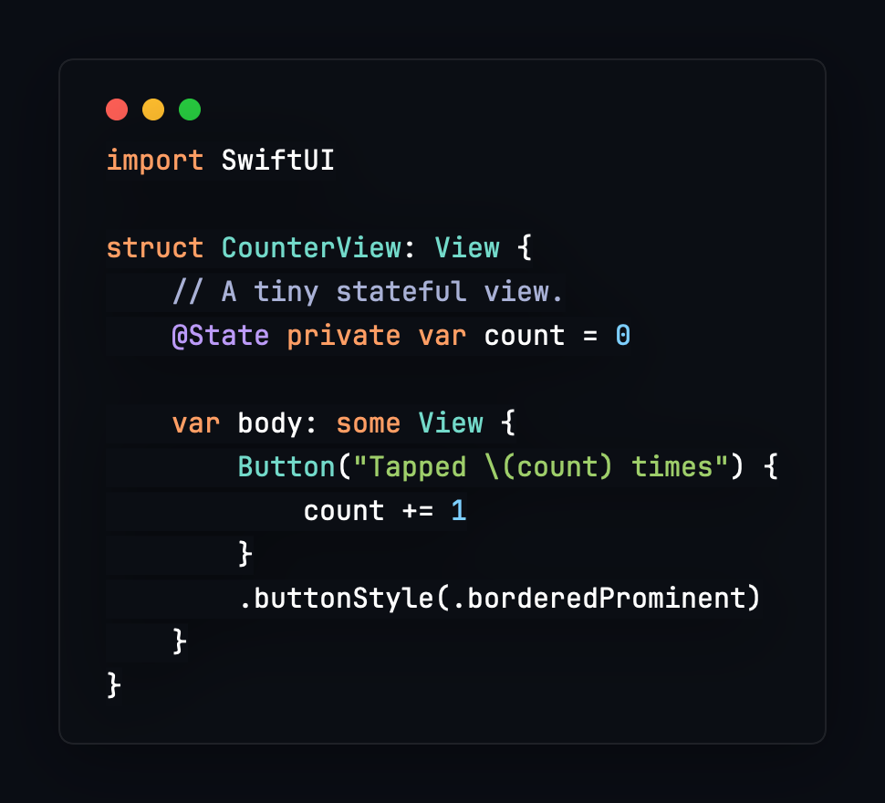 |

| Annotated markup (counter, box, blur, arrow) | GitHub-style diff coloring |
| --- | --- |
| 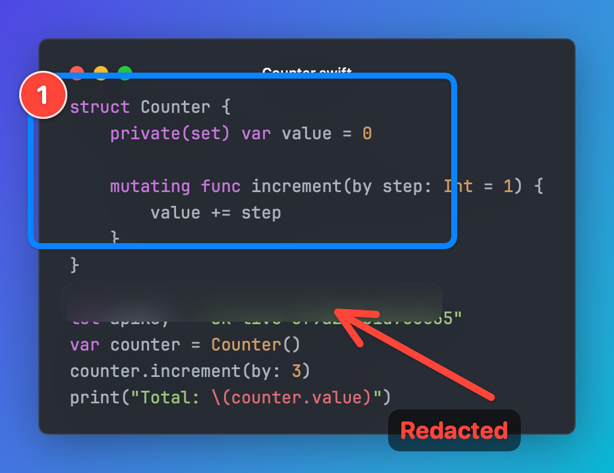 | 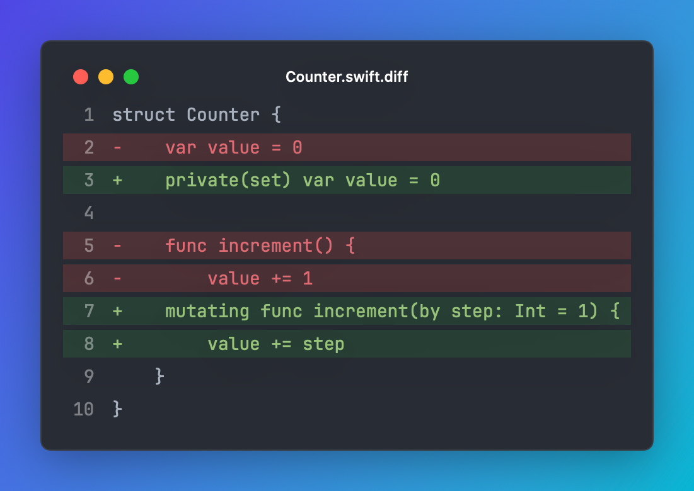 |

**Full-screen TUIs** — Vitrine reconstructs the final screen (cursor moves, colors, and all), not just scrolling output. Real captures of `htop`, `lazygit`, and Neovim:

| `htop` · One Dark | `lazygit` · Dracula | `nvim` · Nord |
| --- | --- | --- |
| 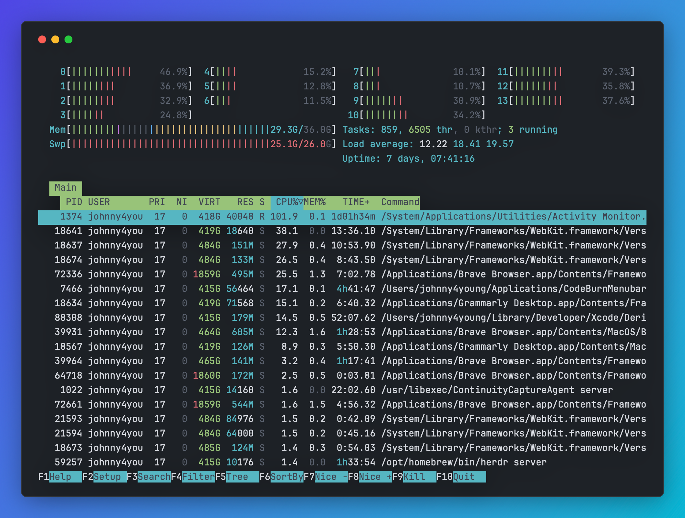 | 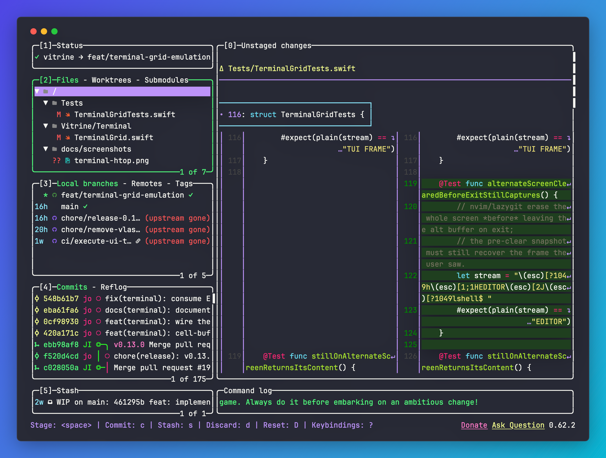 | 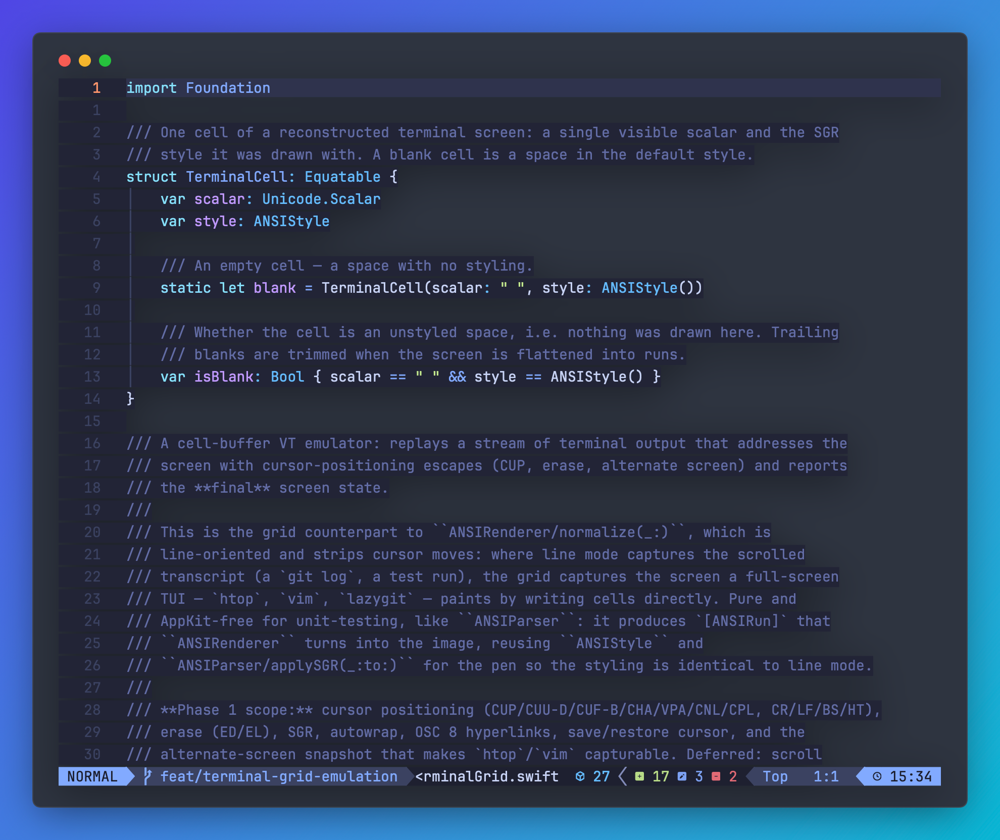 |

</div>

> How the gallery is generated, what it covers, and the design-QA process live in
> [**docs/DESIGN-QA.md**](docs/DESIGN-QA.md).

## Features

Vitrine does one thing — turn code into an image worth sharing. Code, terminal, image,
and pasted-HTML rendering stays on your Mac; URL snapshots fetch the page you request
and render it locally in WebKit.

### Capture

Lives in the menu bar (`LSUIElement`, no Dock icon) and opens from anywhere with a
global hotkey (`⇧⌘S`). It reads the clipboard, detects **code, terminal output, or a
URL**, and picks the matching workflow — one-step Quick mode for code using your saved
style, or the editor when you want to fine-tune. Pasted HTML opens the dedicated Web
Snapshot editor.

### Live files

Open **Live file** from the editor's code header to connect one explicitly selected
source file for that window. Clean editor content refreshes after the file is saved; if
you have typed locally, Vitrine shows **Reload** and **Keep** instead of replacing
your work. The connection is session-only: ordinary drops stay one-time imports, no
folder is scanned, no bookmark is stored, and access ends when you stop watching or
close the window. See [Living snapshots](docs/LIVING-SNAPSHOTS.md).

### Comparison boards

Open **Recents**, choose **Compare**, then select two to four captures in the order you
want to explain them. Vitrine renders each selection once into a temporary board where
you can edit labels and details, reorder or remove items, and choose automatic, row,
column, or grid layout before copying, saving, or sharing the finished image. The board
is session-only and path-free: it stores neither source-file locations nor references
back into Recents. See [Comparison boards](docs/COMPARISON-BOARDS.md).

| Ordered selection in Recents | Session-only board editor |
| --- | --- |
| 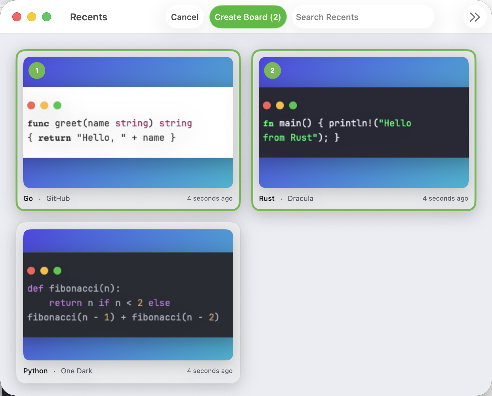 |  |

### Beautify any image

Not just code — drop, paste, or quick-capture **any screenshot** and render it on the
same gradients, padding, and shadow. Frame it as a **macOS window**, a **browser**, or a
**MacBook / iPhone** mockup, with chrome that auto-tints to the image's own colors so it
blends in. *(Browser and device frames are [PRO](#vitrine-pro).)*

### Style

Thirteen built-in themes (plus your own), 33 syntax languages plus Terminal and Plain
Text modes, developer fonts, and solid / gradient / image backgrounds. **Focus mode** dims
everything but the lines that matter; **diff coloring** bands `+`/`−` lines
GitHub-style; window chrome, padding, corner radius, and shadow are all yours to tune.

### Annotate

A CleanShot-style palette in the title bar — arrows (straight and **curved**), lines,
rectangles, text callouts, a highlighter, blur/redaction boxes, numbered counters,
**emoji stickers**, a **spotlight** that dims everything but the regions you draw, and a
**measure** ruler that labels the pixel span between two points. Draw them on the live
preview, move and resize with handles, undo with ⌘Z; they are baked into the export.
**Redact secrets** goes one better: one click scans the capture for API keys, tokens,
and passwords and blurs those lines for you — image *and* copyable text.

### Export & share

Retina **PNG**, **PDF**, and **HEIC** to the clipboard, a file, or the Share Sheet — sRGB
by default (Display P3 on demand), with real alpha for transparent backgrounds.
The editor's alternate copy menu can also produce highlighted RTF/HTML, a PNG data URI,
or a self-contained Markdown block with the rendered image and redaction-safe source.
The share sheet gains **Post to X / LinkedIn / Bluesky** compose targets — the image is
staged on the clipboard and the compose page opens, one paste from posting.
Destination presets cover **OpenGraph** (1200×630), an **Instagram Story**, and a
**GitHub banner**. [PRO](#vitrine-pro) adds **multi-size one-pass export**, **carousel
export** (a long snippet split into numbered 4:5 slides), and the bundled
**`vitrine` CLI** that renders the same pixels from your terminal.

### Crafted & private

One design-token system drives every surface in light and dark. Localized in English
and Spanish, updated over Sparkle on the direct-download build, and reachable from
Shortcuts and App Intents.

> [!NOTE]
> **Private by design.** Code, terminal, image, and pasted-HTML rendering stays local
> and sandboxed — no Vitrine cloud renderer, account, analytics, or telemetry. The
> direct-download build uses network only for updates, license activation, and URL
> content you explicitly request.

**At a glance**

| Area | What you get |
| --- | --- |
| **Capture** | Menu-bar app, global hotkey, clipboard detection (code · terminal · URL), Quick and editor modes, explicit session-only live files; pasted HTML uses Web Snapshot |
| **Beautify** | Drop/paste any image → frame it (macOS window · browser · MacBook · iPhone) with auto-matched chrome |
| **Style** | 13 themes + custom, 33 syntax languages plus Terminal and Plain Text modes, fonts, gradient & image backgrounds, focus mode, diff coloring |
| **Annotate** | Arrows (straight · curved), lines, boxes, text, highlighter, blur, counters, spotlight, measure, stickers — with undo/redo |
| **Redact** | One-click secret scan — blurs API keys / tokens / passwords in the image *and* the copyable text |
| **Export** | Retina PNG/PDF/HEIC, Markdown/data-URI/rich-text copy, file · Share Sheet, post-to compose targets, OpenGraph · Story · GitHub-banner presets, 2–4 capture comparison boards |
| **Platform** | One design system (light & dark), English + Spanish, Sparkle updates, recents |
| **PRO** | Brand Kit watermark · multi-size one-pass export · automation (`vitrine` CLI, Shortcuts/App Intents, folder batch) — optional one-time license |

<details>
<summary>Everything, in detail</summary>

- 🍫 Native **menu-bar app** (`NSStatusItem`, `LSUIElement` — no Dock icon, no app switcher).
- ⌨️ Configurable **global hotkey** (`⇧⌘S`) via [KeyboardShortcuts](https://github.com/sindresorhus/KeyboardShortcuts).
- 🌈 **Syntax highlighting** for 33 shipped syntax languages via [Highlightr](https://github.com/raspu/Highlightr) (Highlight.js), plus Terminal and Plain Text modes. Use `vitrine list languages --json` to inspect the catalog shipped by your build.
- 🖥️ **Terminal output → image** — paste or drop colored terminal output (`git`, test runners, build logs) and Vitrine renders the ANSI/SGR styling (16 / 256 / truecolor, bold · italic · underline · strikethrough · inverse, plus OSC 8 hyperlinks); the palette follows your theme. The `vgrab` shell helper *(PRO)* captures a command's output with its color intact and adds a compact project, current Git branch when available, and command header so the image keeps its context when shared (`--no-context` restores an output-only capture). It also supports **full-screen TUIs** (`htop`, `vim`, `lazygit`), whose final screen Vitrine reconstructs with a cell-buffer emulator — wide CJK and emoji included — and a copyable-text sidecar can ship the output as text alongside the image. `vpane` *(PRO)* images a tmux pane's visible contents without re-running anything, and dropping an **asciinema** recording (`.cast`) replays it into the same renderer. → [`docs/TERMINAL.md`](docs/TERMINAL.md).
- 🖼️ **Beautify any image** — drop, paste, or quick-capture any screenshot (not just code) and render it on the same backgrounds, padding, and shadow, optionally wrapped in a macOS-window, browser, or MacBook / iPhone device frame. The frame chrome auto-tints to the image's top-edge color so it blends in (Light/Dark are manual overrides). Browser and device frames are PRO.
- 🧹 **Tidy indentation on paste** — pasted code is re-indented by structure (braces, JSX tags, JSON), with a Settings toggle, undo with ⌘Z, and ⌥⌘F to format on demand.
- 🔄 **Living snapshots** — explicitly open one source file from the editor and its clean content refreshes after saves. Local edits are never overwritten: a changed disk version waits for **Reload** or **Keep**. The watcher is scoped to that window and is not restored or persisted. → [`docs/LIVING-SNAPSHOTS.md`](docs/LIVING-SNAPSHOTS.md).
- 🎨 **13 built-in themes** (One Dark, Dracula, Nord, Tokyo Night, Gruvbox, Monokai, Solarized, GitHub / GitHub Dark, Xcode Dark, Night Owl, and light variants) plus your own custom themes, gradients, window chrome, padding, fonts.
- ✏️ **Annotate the snapshot** — a CleanShot-style tool palette in the title bar: arrows (straight and curved), lines, rectangles, text callouts, a highlighter, blur/redaction boxes, numbered counters, emoji stickers, a **spotlight** that dims everything outside the regions you draw, and a **measure** ruler that labels the pixel span between two points. Draw them on the live preview, move/resize with handles, restyle color and thickness, and undo/redo with ⌘Z.
- 🔒 **Redact secrets in one click** — scan the capture for likely API keys, tokens, passwords, and private keys (AWS, GitHub, Slack, Google, Stripe, OpenAI, JWTs, `name = value` assignments) and blur the matching lines before you share. The copyable text rider (clipboard / `--text-sidecar`) is sanitized too, so the secret can't leak through the text the image hides; terminal captures are scanned on the resolved screen.
- 🎯 **Focus & diff** — dim the lines outside your highlight, and color `+`/`−` diff lines GitHub-style (automatic for the Diff language). Plus an optional window title and tunable corner radius and shadow.
- 🖼️ **Retina PNG export** (`ImageRenderer` @2x/@3x) → clipboard or file, plus the macOS Share Sheet, with **PDF** as the scalable vector format and **HEIC** as the compact one for docs sites and wikis. Exports are **sRGB by default** (Display P3 is an explicit advanced option) and transparent backgrounds keep real alpha.
- 📣 **Post to X / LinkedIn / Bluesky** — compose targets in the share sheet: the image is staged on the clipboard and the network's compose page opens with a paste hint. One paste from posting; Vitrine sends nothing anywhere.
- 🎠 **Carousel export** *(PRO)* — split a long snippet into numbered 4:5 slides (`carousel-01.png` …) for a LinkedIn/Instagram carousel. Pick the lines per slide; the split balances so the last slide never trails, and every slide carries your style and brand mark.
- 📌 **Pinned snapshot** — pin the current render in a floating window that stays above every app and follows you across Spaces, so the error or design you're working against stays visible while you code.
- 🔤 **Copy text from image** — one click runs on-device OCR (Vision) on a beautified screenshot and puts the recognized text on the clipboard. Nothing leaves the Mac.
- 📐 **Safe-area guides** — an editor-only overlay that draws the margin platforms may crop over a fixed-size destination, with a live "lines × widest column" chip; never part of the export.
- 📝 **Developer-grade copy formats** — copy highlighted RTF/HTML, a standalone PNG data URI, or one self-contained Markdown block containing the image plus copyable fenced source. Redacted lines stay redacted in every text representation.
- 🪧 **Social cards** — compose a 1200×630 card from your code (template, theme, background) to copy, save, or share, with **Instagram Story** and **GitHub banner** export presets.
- 🌐 **Web snapshots** — render pasted **HTML** offline, or capture a **webpage** (direct-download build) after a first-use privacy disclosure. The requested page is fetched and rendered locally in WebKit; there is no remote screenshot service. Pick **several viewports at once** (social · desktop · Full HD · mobile · custom) and Vitrine captures each in one pass, then composes them into a shareable **responsive board** — desktop, tablet, and phone side by side for responsive QA.
- ⚙️ **Settings** — a six-pane sidebar window with a pinned live preview and chip pickers for themes, fonts, and backgrounds.
- ✨ A coherent **design system** — one token layer (colors, gradients, spacing, type) drives every surface in light and dark, and the editor stage glows with the ambient color of your background.
- 🕘 **Recents gallery** — a visual history of your captures, one click from the menu bar. Enter **Compare** to select two to four captures in order and compose a labelled, path-free board for before/after reviews or release notes. → [`docs/COMPARISON-BOARDS.md`](docs/COMPARISON-BOARDS.md).
- 🚀 **First-run quick-start**, offline in-app **Help**, and a **What's New** window on upgrades.
- ⚡ **Shortcuts / App Intents** *(PRO)* — render a code image or open the editor from Shortcuts and Spotlight.
- 🔁 **Sparkle auto-updates** on the direct-download (DMG) channel — "Check for Updates…" in the menu.
- 🌍 **Localized** in English and Spanish (String Catalog), with pseudolocale and RTL layout tests.
- 🖥️ **Command-line renderer** *(direct-download PRO)* — `vitrine render input.swift --out image.png` for docs pipelines and automation, with output pixel-identical to the app's local render path (no URL capture, network, screen recording, or Accessibility needed).
- 💎 **PRO power features** — [Brand Kit](#vitrine-pro) watermark (now with a scannable **QR link chip** and a **signature footer bar** placement), multi-size one-pass export, carousel export, and the automation surfaces above; core capture and editing stay free.
- 🔒 Sandboxed local rendering — your code **never leaves your Mac** when Vitrine renders code. URL capture is the explicit exception because the requested page must be fetched.

</details>

## Vitrine PRO

Vitrine is MIT-licensed and free to use. Core capture and editing remain free — no
watermark, no resolution cap, no launch-time nags. **PRO** is an optional **one-time**
license for people who publish professionally:

- **Brand Kit** — your logo, handle, and accent color applied as a tasteful watermark to
  every export, in one click.
- **Multi-size export** — one capture rendered to every platform size (X, LinkedIn,
  OpenGraph, …) into a folder in a single pass.
- **Automation** — the `vitrine` command-line renderer, Shortcuts / App Intents, and folder
  batch rendering.

It is **honor/convenience, not anti-fork DRM**. On the Mac App Store, PRO is a StoreKit
in-app purchase; on the direct-download build, a license key activates **once** online and
the app then verifies an **offline, signed token** on every launch (the bundled CLI
re-verifies the same token), so PRO works without the network after activation. Nothing
about your code or usage is ever sent. Details: [`docs/PRO.md`](docs/PRO.md).

## Privacy

Vitrine is private by design, and that promise does not soften as the product grows:

- **Code rendering: your code never leaves your Mac.** Rendering a code image is fully
  local and on-device — no account, and no network at all on the App Store build (it ships
  sandboxed *without* the network entitlement). Rendering needs no Screen Recording or
  Accessibility permission.
- **Living snapshots are explicit and temporary.** Vitrine reads only the source file
  you choose, never scans its folder, never writes back to it, and retains no bookmark.
  The watcher and its security-scoped access end when you stop it or close the editor
  window. The loaded text remains an ordinary editor draft, but the file connection is
  never restored on a later launch.
- **Comparison boards retain pixels, not sources.** A board is created only from captures
  you explicitly select in Recents. Its draft contains the rendered images and the labels
  you see, with no file paths, security bookmarks, source text, or persistent reference to
  capture history; closing the board discards that draft.
- **URL capture: the requested webpage loads locally.** When a copied URL is captured,
  Vitrine loads that webpage **locally in WebKit on your Mac** and turns it into an image
  on-device. There is **no remote screenshot service** — the URL is never sent off your
  machine to be rendered. URL capture is opt-in, gated behind the network entitlement
  (present only on the direct-download build), and shows a first-use disclosure before any
  page loads. Only `http`/`https` URLs are accepted. Private and local-network hosts are
  refused; a separate default-off setting can allow only this Mac's loopback interface
  (`localhost`, `127/8`, and `::1`) for development servers. `.local`, LAN, link-local,
  metadata, and other private addresses stay blocked. The web view uses a non-persistent
  data store by default (no cookies or website data persist across captures unless you
  opt in).
- **PRO activation contacts only the license provider, once.** On the direct-download build,
  activating a PRO license makes a single online check to the license provider (Lemon
  Squeezy) to validate your key; afterward PRO is verified from an offline signed token and
  never touches the network again. Nothing about your code or usage is sent. (On the Mac App
  Store, PRO is an ordinary StoreKit purchase.)
- **No analytics, no telemetry, ever.** Code rendering, URL capture, and PRO activation
  collect, track, and transmit **no** usage data. The bundled privacy manifest declares no
  tracking and no collected data, so the App Store privacy label is **Data Not Collected**.

The permission and privacy posture is documented in
[**docs/PROJECT.md**](docs/PROJECT.md#privacy-and-permissions); the full
entitlement-by-entitlement audit table for each distribution channel is in
[**docs/PERMISSIONS.md**](docs/PERMISSIONS.md).

## Tech stack

| Layer            | Choice                                                        |
| ---------------- | ------------------------------------------------------------- |
| Language          | **Swift 6**                                                  |
| UI                | **SwiftUI** + AppKit (`NSStatusItem`, `NSPopover`, `NSTextView`, `NSPasteboard`) |
| Highlighting      | [Highlightr](https://github.com/raspu/Highlightr)            |
| Global hotkey     | [KeyboardShortcuts](https://github.com/sindresorhus/KeyboardShortcuts) |
| Auto-updates      | [Sparkle](https://sparkle-project.org) (direct-download channel) |
| View → image      | `ImageRenderer` (built-in)                                    |
| Project gen       | [XcodeGen](https://github.com/yonaskolb/XcodeGen) (`project.yml`) |

## Requirements

- macOS **14.0+** (Sonoma or later)
- **Xcode 16+**
- [XcodeGen](https://github.com/yonaskolb/XcodeGen), installed from the verified
  release asset with `./scripts/install-xcodegen.sh` — the `.xcodeproj` is generated,
  not committed.

## Getting started

```bash
git clone https://github.com/johnny4young/vitrine.git
cd vitrine
./scripts/install-xcodegen.sh
export PATH="$HOME/.local/bin:$PATH"

# Generate Vitrine.xcodeproj from project.yml and open it
make            # == make bootstrap → xcodegen generate → open
```

Or step by step:

```bash
make project    # xcodegen generate  → Vitrine.xcodeproj
make open       # open Vitrine.xcodeproj in Xcode
make build      # headless xcodebuild (Debug)
make cli        # build the `vitrine` command-line renderer
make test       # run the Swift Testing suite
make build-ui-tests # compile UI tests without automation permission
make test-ui    # run UI smoke tests (first local run prompts for automation permission)
make gallery    # (re)generate the launch-gallery design-QA samples
make format     # swift-format in place
make lint       # swift-format lint (CI gate)
make icon       # regenerate the app icon set
```

Then hit **▶︎ Run** in Xcode. Vitrine appears in the menu bar (📸). There is no Dock
icon — that's intentional (`LSUIElement`).

> **Why is `Vitrine.xcodeproj` not in the repo?** It's generated from
> [`project.yml`](project.yml) so it can never drift from the spec and never causes
> merge conflicts. Run `make project` (or `xcodegen generate`) after cloning. See
> [CONTRIBUTING.md](CONTRIBUTING.md).

## Command-line renderer

The `vitrine` CLI is for the moments when opening a window would interrupt the flow:
turning a source file into a README image, capturing the diff you are about to review,
preserving a colored test run, or rebuilding a whole documentation gallery in CI. It
uses the same renderer, themes, fonts, backgrounds, annotations, and export formats as
the app, so automation does not create a second visual system.

**New to the CLI?** Start with the searchable, bilingual
[**CLI guide and reference**](https://vitrineframe.app/cli). It explains every command
and option with copyable examples, practical workflows, and troubleshooting.

### Where the CLI comes from

| Installation | CLI availability |
| --- | --- |
| **Homebrew cask** | Installs Vitrine and puts `vitrine` on your `PATH` automatically. |
| **Signed DMG** | The binary is inside the app. Enable it from **Settings ▸ General ▸ Command-line tool ▸ Install…**. The DMG does **not** add it to your PATH automatically. |
| **Mac App Store** | Does not include the CLI because App Store apps do not distribute command-line tools on `PATH`. |
| **Source checkout** | `make cli` builds the development binary in DerivedData, next to its required resources. |

Commands that create images require an **activated direct-download PRO license**.
Inspection commands — `--version`, `list`, and `recipe validate/show` — remain
available before the render gate, which makes installation and configuration easy to
check. A Debug source build can use `VITRINE_PRO_UNLOCK=1` for local QA; release builds
ignore that variable.

### Your first useful image

```bash
# 1. Confirm the command is the version you expect.
vitrine --version

# 2. Render one file. Language comes from the extension; PNG comes from --out.
vitrine render Sources/App.swift --out app-card.png

# 3. Open the file to inspect the result.
open app-card.png
```

Without extra options, the CLI uses Vitrine's familiar defaults: One Dark, JetBrains
Mono, the aurora background, and retina output. Add choices only when the image needs
them:

```bash
vitrine render Sources/App.swift --out launch-card.png \
  --theme dracula --preset opengraph --title "Vitrine 1.0"
```

### Pick a command by intent

| You want to… | Command |
| --- | --- |
| Create one image from a file, pipe, Git diff, or local image | `vitrine render` |
| Export one source at several social/documentation sizes | `vitrine multi-size` |
| Generate images for a folder or documentation tree | `vitrine batch` |
| Validate or inspect a portable style recipe | `vitrine recipe` |
| Discover valid theme, language, preset, font, frame, or format IDs | `vitrine list` |
| Verify the installed version and build | `vitrine --version` |
| Enable `vgrab` and `vpane` terminal helpers | `vitrine shell-init` |

Run `vitrine render --help` for the exact reference shipped by your installed build, or
use the [web reference](https://vitrineframe.app/cli#reference) to search every option.

### Everyday workflows

**Pipe code without creating a temporary file.** `--stdin-name` gives Vitrine a safe
filename hint for language detection and metadata; it does not read that path.

```bash
cat Component.tsx | vitrine render --stdin \
  --stdin-name Component.tsx --copy
```

**Share exactly what is staged.** Vitrine asks `/usr/bin/git` directly, disables pagers
and external diff drivers, and never fetches missing objects.

```bash
vitrine render --git-staged --git-context 6 --out staged-review.png
vitrine render --git-diff main...HEAD --git-path Vitrine/CLI --out cli-review.png
```

**Capture a terminal command with the context a shared image needs.** The `vgrab`
helper preserves ANSI color and adds the project, current Git branch when available,
and exact command above the result. Use `--no-context` whenever arguments, paths, or
branch names should remain private.

```bash
# One-time zsh setup; bash and fish are supported too.
eval "$(vitrine shell-init zsh)"

vgrab npm test
vgrab -e git status                 # finish styling or annotating in the editor
vgrab --no-context env | sort       # deliberately omit project, branch, and command
```

See [Terminal capture](docs/TERMINAL.md) for `vpane`, full-screen TUIs, color-preserving
pipes, and shell-specific setup.

**Reuse one visual language without hidden repository configuration.** Export a
workspace recipe from **Settings ▸ Library**, inspect it, then pass its path explicitly.
The CLI never searches parent folders or app storage for a recipe, and explicit flags
still win over recipe values.

```bash
vitrine recipe validate docs.vitrine-recipe.json
vitrine recipe show docs.vitrine-recipe.json --json
vitrine render README.md --out readme.png \
  --recipe docs.vitrine-recipe.json --scale 2
```

| Explicit CLI inspection | Machine-local folder association |
| --- | --- |
| 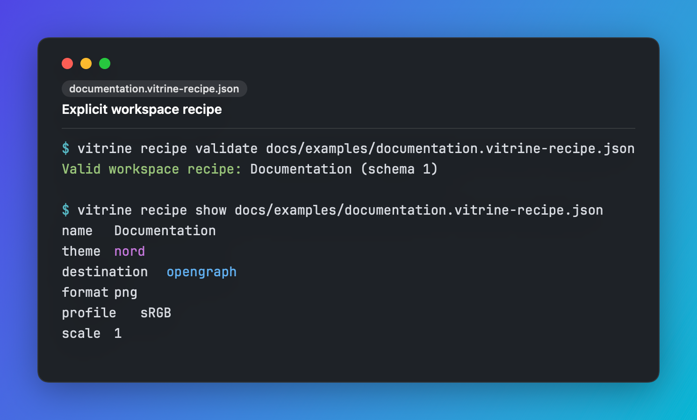 | 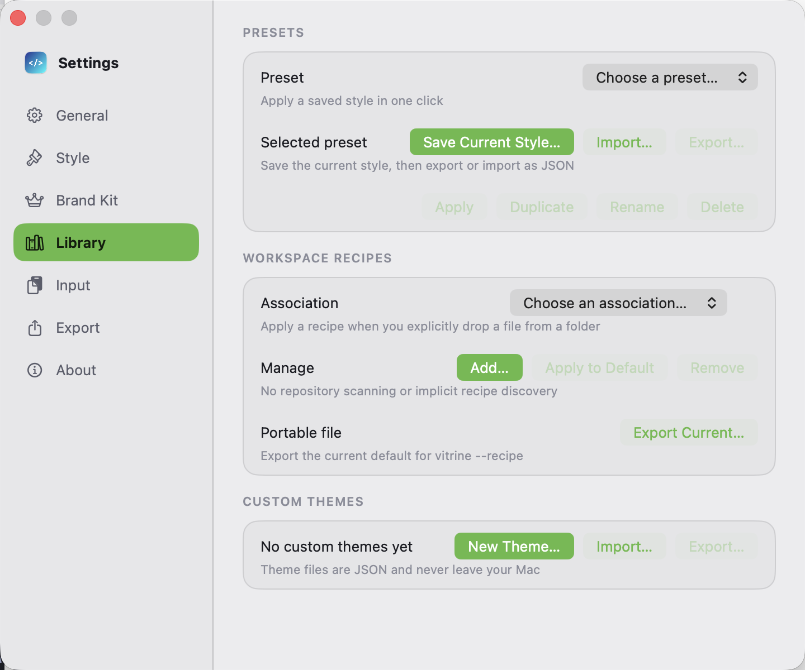 |

See [Workspace recipes](docs/WORKSPACE-RECIPES.md) for the versioned schema, precedence,
privacy boundary, and a runnable tracked example.

**Create an image pack from one source.** Destination presets own their dimensions and
recommended scale, while your style and metadata apply to every result.

```bash
vitrine multi-size launch.swift --out launch-assets \
  --presets twitter,linkedin,opengraph \
  --recipe launch.vitrine-recipe.json
```

**Make a documentation batch strict enough for CI.** Dry-run first, require at least one
matching input, fail when anything is skipped, and retain machine-readable evidence.

```bash
vitrine batch Sources --out docs/cards --recursive \
  --include-ext swift,md --dry-run --fail-on-empty

vitrine batch Sources --out docs/cards --recursive \
  --include-ext swift,md --fail-on-empty --fail-on-skipped \
  --manifest docs/cards/manifest.json \
  --skipped-report docs/cards/skipped.json
```

**Redact before adding selectable source.** `--redact-secrets` and `--redact-lines`
sanitize both the rendered rows and text/Markdown/HTML sidecars. A visual `--blur-box`
changes pixels only and must not be used as a text-sanitization boundary.

```bash
vitrine render config.swift --out safe.png \
  --redact-secrets --sidecars all
```

### Local by construction

The CLI renders code, terminal content, and local images only. It does not capture URLs,
call a hosted renderer, scan repositories for configuration, or require network, Screen
Recording, or Accessibility permissions. Local background and watermark images are
copied into invocation-scoped temporary storage and removed when the command exits.

For the complete option catalog, aliases, bounds, examples, and workarounds, use the
[**Vitrine CLI documentation**](https://vitrineframe.app/cli). The installed binary
remains the final source of truth: `vitrine render --help` and `vitrine list all --json`
report exactly what that build accepts.

## Project layout

```
vitrine/
├── project.yml            # XcodeGen spec — source of truth for the Xcode project
├── Makefile               # bootstrap / project / build / test / gallery helpers
├── Vitrine/               # app source (see docs/ARCHITECTURE.md)
│   ├── App/               # @main, AppDelegate, main menu, window controllers
│   ├── MenuBar/           # helper coordination, AppKit popover + quick capture
│   ├── Onboarding/        # first-run quick-start
│   ├── Editor/            # code editor, ambient-light stage, inspector, language detection
│   ├── Canvas/            # the SwiftUI views that become the exported image
│   ├── Rendering/         # capture input → code render pipeline
│   ├── WebRendering/      # local URL/HTML snapshots (WebKit, on-device)
│   ├── SocialCards/       # social-card composition
│   ├── Export/            # ImageRenderer → PNG/PDF → clipboard / file / share
│   ├── Recents/           # capture history + gallery window
│   ├── Help/              # offline Help + What's New release notes
│   ├── Feedback/          # capture HUD, notifications, diagnostics bundle
│   ├── Settings/          # six-pane Settings window, presets, custom themes
│   ├── Pro/               # open-core PRO gate: entitlements, StoreKit + license providers, Brand Kit, paywall
│   ├── DesignSystem/      # token layer (VitrineTokens) + shared chrome components
│   ├── AppIntents/        # Shortcuts / App Intents surface
│   ├── Updates/           # Sparkle auto-update integration (DMG channel)
│   ├── Services/          # macOS Services registration
│   ├── CLI/               # render core shared with the CLI target
│   ├── Models/, State/, Support/   # config, themes, persistence, logging
│   └── Resources/         # assets, Info.plist, entitlements, String Catalog
├── VitrineCLI/            # the `vitrine` command-line renderer target
├── VitrineMenuBarHelper/  # sandbox-inheriting, paint-only status-item owner
├── Tests/                 # Swift Testing unit suite + golden/gallery fixtures
├── UITests/               # XCTest UI smokes + opt-in screenshot tour
├── site/                  # Astro static website (semantic HTML + vanilla CSS/JS)
└── docs/                  # current product, architecture, privacy, and release docs
```

## Documentation

The repository keeps current product, architecture, privacy, and release documentation
in [`docs/`](docs/):

- [**CHANGELOG.md**](CHANGELOG.md) — the complete, versioned change history ([Keep a Changelog](https://keepachangelog.com)).
- [**docs/PROJECT.md**](docs/PROJECT.md) — vision, positioning, naming, distribution, risks.
- [**docs/ARCHITECTURE.md**](docs/ARCHITECTURE.md) — menu-bar UX, user flow, modules, data model.
- [**docs/PRO.md**](docs/PRO.md) — the PRO subsystem: the open-core gate, per-build providers, Brand Kit, multi-size export, and automation.
- [**docs/ACTIVATION.md**](docs/ACTIVATION.md) — direct-download PRO activation runbook: keypair generation, build-time key injection, and the Lemon Squeezy product.
- [**docs/RENDERING.md**](docs/RENDERING.md) — how every supported input reaches the local render and export pipeline.
- [**docs/SCREEN-CAPTURE.md**](docs/SCREEN-CAPTURE.md) — why arbitrary screen/window capture is outside the product boundary.
- [**docs/LIVING-SNAPSHOTS.md**](docs/LIVING-SNAPSHOTS.md) — explicit session-only file refresh, conflict behavior, and privacy boundary.
- [**docs/WORKSPACE-RECIPES.md**](docs/WORKSPACE-RECIPES.md) — portable recipe schema, explicit CLI usage, local folder associations, and privacy boundaries.
- [**docs/COMPARISON-BOARDS.md**](docs/COMPARISON-BOARDS.md) — ordered Recents selection, board editing, export behavior, and session-only data ownership.
- [**docs/PERMISSIONS.md**](docs/PERMISSIONS.md) — every entitlement with its reason, user-facing behavior, and App Store impact by channel.
- [**docs/DESIGN-QA.md**](docs/DESIGN-QA.md) — the generated launch gallery and the design-QA process.
- [**docs/RELEASING.md**](docs/RELEASING.md) — signed/notarized DMG, Homebrew cask, release workflow.

## Status

🟢 **v1.0.0 is the stable release.** Everything under [Features](#features) ships in
the signed direct-download build and is driven by one design-token system
([`Vitrine/DesignSystem/`](Vitrine/DesignSystem)) in light and dark. The product is
covered by a Swift Testing unit suite plus XCTest UI smokes; CI
runs lint, build, the unit tests, and the full UI suite on GitHub's hosted macOS runners
(which pre-authorize XCTest UI automation — see [docs/RELEASING.md](docs/RELEASING.md)).
The complete, versioned history lives in [CHANGELOG.md](CHANGELOG.md), and every release
also ships an in-app **What's New**.

Anything added under **Unreleased** in the changelog belongs to a future build and is not
part of the v1.0.0 artifact until another release workflow publishes it.

Two explicit product boundaries — no arbitrary screen/window capture and no dependency
on a hosted web-render service — are documented in
[docs/SCREEN-CAPTURE.md](docs/SCREEN-CAPTURE.md) and
[docs/RENDERING.md](docs/RENDERING.md).

## Contributing

Themes and language tweaks are especially welcome. See [CONTRIBUTING.md](CONTRIBUTING.md)
and the conventions in [AGENTS.md](AGENTS.md). Usage questions follow
[SUPPORT.md](SUPPORT.md), community participation follows
[CODE_OF_CONDUCT.md](CODE_OF_CONDUCT.md), and security issues go privately through
[SECURITY.md](SECURITY.md).

## License

[MIT](LICENSE) © johnny4young
